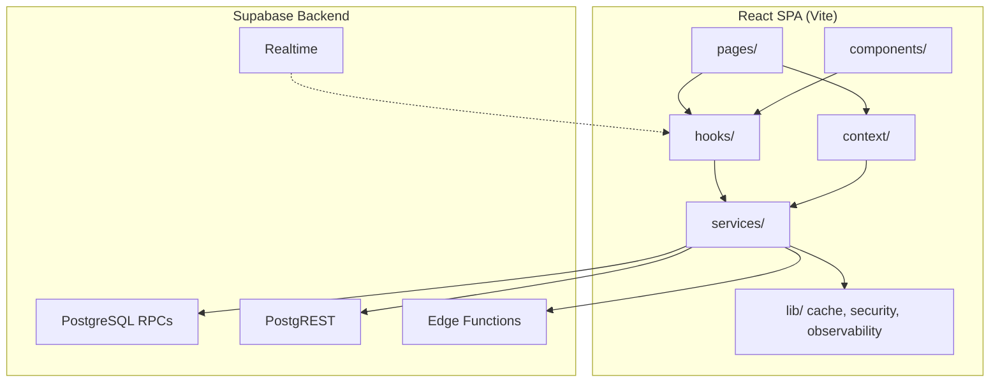

# Platform Architecture Report

**Date:** 2026-06-25  
**Role:** Principal Software Architect  
**Codebase:** Slaash — multi-tenant e-commerce SaaS (React + Supabase)  
**Maintainability baseline:** 88/100 (post cleanup)

---

## Executive Summary

| Metric | Score | Trend |
|--------|-------|-------|
| **Architecture maturity** | **82 / 100** | ↑ from Lovable prototype |
| **Layer separation** | **85 / 100** | Pages clean; components leak DB |
| **Scalability readiness** | **88 / 100** | RPC-first + tenant isolation |
| **Team onboarding readiness** | **78 / 100** | Needs docs + boundary enforcement |

The platform has evolved into a **service-oriented SPA** with a clear intended flow:

```
Pages → Hooks → Services → Supabase (RPC / PostgREST / Edge)
         ↓
      Context (session, cart, hydration, subscription)
```

Remaining debt is **concentrated**, not systemic: one legacy product module (`dummyData.ts`), marketing components with direct DB access, and inconsistent page→hook discipline.

---

## Current Architecture

### System context



### Provider stack (`App.tsx`)

| Order | Provider | Responsibility |
|-------|----------|----------------|
| 1 | `QueryClientProvider` | Server-state cache (5 min stale) |
| 2 | `AuthProvider` | Session, login, profile bootstrap |
| 3 | `SubscriptionProvider` | Merchant access / admin flag |
| 4 | `StoreBootstrapProvider` | Post-login hydration gate |
| 5 | `StoreProvider` | Merchant branding UI state |
| 6 | `CartProvider` | Per-owner session cart |

**Hydration gate:** `merchantHydration.ts` fans out to product, store, order, and health services before merchant UI renders.

---

## Folder Structure

### Standard layout

| Directory | Files | Purpose |
|-----------|------:|---------|
| `pages/` | 28 | Route screens only — lazy loaded |
| `hooks/` | 29 | Data fetching + page orchestration |
| `services/` | 20 | **Only layer that talks to Supabase** (target) |
| `components/` | ~157 | Presentational + domain UI |
| `context/` | 6 | Cross-cutting client state |
| `lib/` | 48 | Cache, security, observability, tenant registry |
| `utils/` | 41 | Pure functions (no DB) |
| `types/` | 6 | Shared domain types |
| `mappers/` | 4 | DB row → domain objects |
| `integrations/` | 4 | Supabase client + generated types |
| `data/` | 4 | **Legacy** product catalog engine |

### Naming conventions

| Layer | Pattern | Example |
|-------|---------|---------|
| Pages | PascalCase | `Orders.tsx` |
| Hooks | `use*` | `useCheckoutFlow.ts` |
| Services | `*Service.ts` | `orderService.ts` |
| Imports | Direct path | `@/services/orderService` (no barrel) |

### Anomalies to resolve

| Issue | Location | Target state |
|-------|----------|--------------|
| Misnamed catalog | `data/dummyData.ts` | `merchantProductCatalog.ts` or merge into `productsCrudService` |
| Product facade | `productService.ts` | Thin re-export or delete after migration |
| Tenant triple surface | Context + registry + `useStoreProductsPage` | Single storefront data hook |
| Removed shim | ~~`components/StoreBootstrap.tsx`~~ | ✅ Now imports `StoreBootstrapContext` directly |

---

## Layer Responsibilities

### Pages (`src/pages/`)

**Should:** Compose hooks + components, handle routing params, minimal local UI state.

**Status:** ✅ Zero PostgREST `.from()` calls — excellent boundary.

**Gap:** Heavy pages (`Products.tsx`, `Inventory.tsx`) import services directly instead of container hooks (inconsistent with `Orders.tsx` / `Checkout.tsx`).

### Hooks (`src/hooks/`)

| Category | Examples | Pattern |
|----------|----------|---------|
| Data | `useOrders`, `useStoreProductsPage`, `useRealStatistics` | Service-only |
| Realtime | `useRealtimeOrders`, `useRealtimeProducts` | Service + Supabase channel |
| Orchestration | `useCheckoutFlow`, `useAddProductForm` | Multi-service (watch size) |
| UI | `useDebouncedValue`, `useScrollPersistence` | No DB |

**Bypass services (2):** `useProductViewTracking`, `useStoreVisitTracking` — direct RPC (move to `analyticsService`).

### Services (`src/services/`)

**Pattern:** RPC-first → PostgREST fallback → cache (`lib/cache.ts`) → rate limit where needed.

| Domain | Service | Access |
|--------|---------|--------|
| Orders | `orderService` | RPC + fallback |
| Storefront | `storefrontProductService`, `storefrontEdgeService` | RPC + edge HTTP |
| Products | `productsCrudService`, `productService` (facade) | PostgREST heavy |
| Analytics | `statisticsService`, `dashboardStatsService` | RPC batch |
| Admin | `leadAdminService` | RPC |
| Bootstrap | `merchantHydration` | Orchestrator (no direct DB) |

**Coupling fix applied:** `OrderDashboardStats` / `WorkflowTabCounts` moved to `src/types/orders.ts` — breaks `orderService` ↔ `dashboardStatsService` type cycle.

### Components (`src/components/`)

**Violation:** 9 files import `@/integrations/supabase/client` directly:

- `marketing/CouponsTab.tsx`, `ProductDiscountsTab.tsx`, `MarketingSettingsTab.tsx`
- `product-management/BulkUpload.tsx`, `SuggestedProductsManager.tsx`
- `product-details/RatingSection.tsx`, `SuggestedProducts.tsx`
- `settings/CustomDomainTab.tsx`

**Enforcement added:** ESLint `no-restricted-imports` (warn) on `src/components/**` and `src/pages/**`.

### Context vs hooks overlap

| Concern | Owner today | Recommendation |
|---------|-------------|----------------|
| Auth session | `AuthContext` | Extract `authService` |
| Subscription | `SubscriptionContext` | Sole reader; remove duplicate login fetch |
| Tenant storefront | `TenantStoreContext` + registry | Deprecate empty `products` array on context |
| Merchant settings | `StoreContext` | Keep |
| Cart | `CartContext` | Keep |

---

## Database Access Patterns

### RPC-first (production path)

```
create_order_with_stock_deduction
get_storefront_page_bundle / get_store_products_page
list_merchant_orders / count_merchant_orders_by_workflow
get_dashboard_statistics_batch
increment_product_stock
track_store_visit_by_slug
```

### PostgREST fallbacks

Used when RPC not deployed — `orderService`, `statisticsService`, `storefrontProductService`. **Document as migration-compat only.**

### Edge functions

`storefrontEdgeService` — HTTP cache layer before Supabase for public catalog.

### Typing gap

Widespread `(supabase as any).rpc` — `types.generated.ts` has definitions; adopt `callSupabaseRpc` wrapper incrementally.

---

## State Management Strategy

| State type | Tool | Examples |
|------------|------|----------|
| Server data | React Query + service cache | Orders list, statistics |
| Session | Context | Auth, subscription |
| Ephemeral UI | `useState` in pages/hooks | Filters, dialogs |
| Cross-route client | Context | Cart, store branding |
| Tenant public | Registry + IndexedDB | Storefront meta TTL 10 min |
| Checkout durability | sessionStorage | Idempotency keys |

**Dual cache note:** React Query (5 min) + `lib/cache.ts` (tiered TTL) — document ownership per domain to avoid stale reads.

---

## API & Error Handling

| Pattern | Location |
|---------|----------|
| Arabic order errors | `utils/orderErrors.ts` |
| Auth errors | `lib/authUtils.ts` |
| Domain errors | `LeadSubmitError`, `InventoryRestockError` |
| Global reporting | `lib/observability/reporter.ts` + React Query `onError` |
| Client rate limit | `lib/security/rateLimiter.ts` (UX; server authoritative) |

**Gap:** Marketing components surface raw PostgREST errors — align with service-layer mappers.

---

## Coupling Hotspots

| Rank | Module | Issue | Mitigation |
|------|--------|-------|------------|
| 1 | `AuthContext` | ~44 importers; owns auth + profile + cache | Split `authService` |
| 2 | `dummyData.ts` | Hidden product core | TD-01 migration |
| 3 | `useCheckoutFlow` | 26 imports | Extract validation + submit sub-hooks |
| 4 | `Products.tsx` | 35 imports | `useProductsPage` container |
| 5 | `orderService` | Hub for checkout + list + stats | Keep; types now decoupled |

---

## Standardization Applied (This Audit)

| Change | File |
|--------|------|
| Shared order dashboard types | `src/types/orders.ts` |
| Type re-exports from service | `orderService.ts` |
| Direct context import | `App.tsx` → `StoreBootstrapContext` |
| Removed re-export shim | `components/StoreBootstrap.tsx` |
| ESLint DB boundary | `eslint.config.js` (components + pages) |

---

## Target Architecture (12-month)

```
src/
├── features/           # Optional future: orders/, storefront/, marketing/
│   ├── orders/
│   │   ├── hooks/
│   │   ├── components/
│   │   └── services/   # or keep flat services/
├── pages/              # Thin route shells
├── hooks/              # Shared + feature hooks
├── services/           # Supabase boundary ONLY
├── context/            # Client state only
├── types/              # Cross-cutting domain types
├── lib/                # Infrastructure
└── integrations/       # Supabase client + generated types
```

**Phase 1 (now):** Enforce boundaries, finish product migration.  
**Phase 2 (Q3):** Feature folders for orders + storefront.  
**Phase 3 (Q4):** Typed RPC layer; remove PostgREST fallbacks.

---

## Architecture Score Breakdown

| Dimension | Score | Notes |
|-----------|-------|-------|
| Layer separation | 85 | Pages clean; 9 component violations |
| Service design | 88 | RPC-first, caching, hydration |
| State management | 80 | Dual cache; context overlap |
| Type safety | 75 | `(supabase as any)` widespread |
| Testability | 82 | 132 unit tests; hooks heavy |
| Scalability | 88 | Tenant isolation, edge cache |
| Team clarity | 78 | Needs feature docs + ADRs |
| **Overall** | **82** | Strong foundation |

---

## Roadmap

### Phase 0 — Foundation (Complete ✅)

- [x] Dead code cleanup (54 files)
- [x] Remove service barrel
- [x] Decouple order dashboard types
- [x] ESLint Supabase boundary (warn)
- [x] Direct context imports in App

### Phase 1 — Boundaries (Q2 2026, 2–3 weeks)

| # | Task | Impact | Effort |
|---|------|--------|--------|
| 1.1 | Migrate `dummyData.ts` → `productsCrudService` | High | L |
| 1.2 | Marketing CRUD → `marketingService` | High | M |
| 1.3 | Reviews submit → `reviewService` | Medium | S |
| 1.4 | `analyticsService` for visit/view tracking hooks | Medium | S |
| 1.5 | ESLint boundary → error (after 1.2–1.4) | High | S |
| 1.6 | CI: `types.generated.ts` freshness gate | High | S |

### Phase 2 — Consistency (Q3 2026, 3–4 weeks)

| # | Task | Impact | Effort |
|---|------|--------|--------|
| 2.1 | Container hooks: `useProductsPage`, `useInventoryPage` | Medium | M |
| 2.2 | Extract `authService` from `AuthContext` | Medium | M |
| 2.3 | Typed RPC wrapper (replace `as any`) | Medium | L |
| 2.4 | Document cache ownership matrix | Medium | S |
| 2.5 | Consolidate toast on `sonner` only | Low | S |

### Phase 3 — Scale (Q4 2026, 4–6 weeks)

| # | Task | Impact | Effort |
|---|------|--------|--------|
| 3.1 | Feature-folder pilot (`features/orders/`) | Medium | L |
| 3.2 | Remove PostgREST fallbacks (RPC-only) | High | M |
| 3.3 | Keyset pagination for order list | High | M |
| 3.4 | Archive stale `supabase/apply-*.sql` | Low | S |
| 3.5 | ADR template + 5 initial ADRs | Medium | S |

### Phase 4 — Team scale (2027)

- Module ownership map (orders, storefront, admin, platform)
- Storybook for `components/ui` + domain components
- E2E coverage: checkout, order list, product CRUD
- Optional: React Query as sole server cache (retire duplicate paths)

---

## Decision Records (Recommended ADRs)

| ADR | Decision |
|-----|----------|
| ADR-001 | RPC-first data access; PostgREST fallback temporary |
| ADR-002 | No Supabase imports in components/pages |
| ADR-003 | Service imports via `@/services/{name}` — no barrel |
| ADR-004 | Tenant isolation via `owner_id` + RLS; client never trusts slug alone |
| ADR-005 | Checkout idempotency keys in sessionStorage |

---

## Verification

```bash
npm run typecheck   # ✅
npm test            # ✅ 132 tests
npm run lint        # Warns on component Supabase imports (expected)
```

---

## Related Documents

- [`TECHNICAL_DEBT_REPORT.md`](TECHNICAL_DEBT_REPORT.md) — debt register
- [`CODE_CLEANUP_REPORT.md`](CODE_CLEANUP_REPORT.md) — removed files
- [`POSTGRESQL_SCALE_PERFORMANCE_REPORT.md`](supabase/POSTGRESQL_SCALE_PERFORMANCE_REPORT.md) — DB scale
- [`ORDER_RELIABILITY_REPORT.md`](supabase/ORDER_RELIABILITY_REPORT.md) — checkout reliability

---

*Principal Software Architect review — platform ready for incremental team growth after Phase 1 boundaries.*
