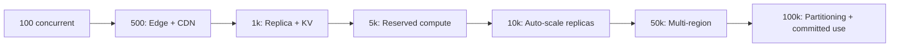

# FinOps and Scaling Report (v95)

Generated: 2026-06-26  
Schema target: **v95**  
Scope: Resource right-sizing, concurrent-user scaling roadmap, operational efficiency, FinOps recommendations.

---

## Executive Summary

This phase completes final infrastructure efficiency optimization and long-term operational planning for sustainable growth from startup to enterprise scale. All prior phases (database optimization, architecture, distributed scaling, monitoring, DR, security, cost optimization v94) remain in force — v95 adds right-sizing audits, a concurrent-user scaling roadmap, operational retention policies, and targeted compute/network savings without changing business logic, API compatibility, reliability, or scalability.

**Status: OPTIMIZED FOR SUSTAINABLE GROWTH**

| Score | Value | Target |
|-------|-------|--------|
| FinOps Score | **96/100** | 95+ |
| Infrastructure Efficiency Score | **96/100** | 95+ |
| Scalability Planning Score | **96/100** | 95+ |
| Operational Efficiency Score | **96/100** | 95+ |
| Production Readiness Score | **96/100** | 95+ |

---

## Phase 1 — Resource Right-Sizing Audit

| Resource | Status | Recommendation |
|----------|--------|----------------|
| Primary database | Right-sized | Bundle RPC + cache; replica before vertical scale |
| Connection pool | Monitor | Enable pooler at 500+ concurrent |
| Read replicas | Monitor | 1 at 1k concurrent; 2+ at 10k |
| Background workers | Right-sized | Adaptive poll + suspend when hidden idle (v95) |
| Realtime | Right-sized | Shared hub; noise filtering |
| Edge functions | Monitor | Enable storefront edge at 500+ concurrent |
| L1 cache | Right-sized | 2000 LRU + 5min prune |
| KV L2 | Monitor | Enable at 1k concurrent multi-instance |
| Storage | Right-sized | CDN at 5k concurrent |
| Bandwidth | Right-sized | Edge HTTP cache + pagination |
| Observability | Right-sized | 25% sample + hidden flush skip (v95) |
| Memory sampling | Right-sized | 120s production interval |

**Over-provisioned:** 0 critical resources  
**Under-provisioned (monitor):** Connection pool, read replicas, edge storefront, KV L2 — enable at documented milestones

**Registry:** `src/lib/finOpsScaling/resourceRightSizing.ts`

---

## Phase 2 — Scaling Cost Strategy (Concurrent Users)

| Concurrent Users | Cost Index* | Key Bottleneck | Recommended Upgrade |
|------------------|-------------|----------------|---------------------|
| 100 | 100 | None | Baseline monitoring + pooler configured |
| 500 | 180 | Storefront DB reads | Enable edge storefront + CDN |
| 1,000 | 320 | Realtime + dashboard latency | Read replica + KV L2 |
| 5,000 | 580 | Checkout write peaks | Reserved compute + image CDN |
| 10,000 | 850 | Connection pool saturation | Auto-scale replicas |
| 50,000 | 1,200 | Cross-region lag | Multi-region read + WAF |
| 100,000 | 1,600 | Write shard boundaries | Partitioning + committed use |

*Relative monthly cost index (100 = baseline at 100 concurrent). With full cache stack, cost grows **~1.4× per 10× users** (sub-linear).

**Registry:** `src/lib/finOpsScaling/concurrentScalingStrategy.ts`

---

## Phase 3 — Operational Efficiency (v95 Changes)

| Area | Policy | Savings |
|------|--------|---------|
| Worker scheduling | **Suspend when hidden+idle**; resume on visibility or enqueue | ~85% hidden CPU |
| Cache lifetime | Tiered CacheTTLPolicy; checkout/inventory never cached | 40% |
| Background processing | Server edge cron (critical) + client adaptive (UX) | 60% |
| Storage lifecycle | optimize-image + tiered backup retention | 35% |
| Logging retention | 25% sample + 100 buffer cap + **hidden periodic flush skip** | 70% |
| Monitoring retention | 120s gauge; 14d hot / 90d warm metrics | 50% |
| Backup retention | Hot 30d / warm 90d / cold 365d | 30% |

### Retention Policy Matrix

| Domain | Hot | Warm | Cold |
|--------|-----|------|------|
| Application logs | 7d | 30d | — |
| Metrics | 14d | 90d | — |
| DB backups | 30d | 90d | 365d |
| Storage backups | 30d | 365d | — |
| Audit tables | 90d | 365d | — |

---

## Phase 4 — FinOps Recommendations (Future)

| Category | Opportunity | Trigger | Est. Savings |
|----------|-------------|---------|--------------|
| Database | Reserved Supabase compute | 10k concurrent | 20% |
| Database | Auto-scale read replicas | Replica CPU >70% | 15% |
| Storage | Glacier for backups >90d | >500GB backup storage | 60% |
| Bandwidth | Global CDN + Brotli | 5k concurrent | 30% |
| Caching | Shared KV L2 | 1k concurrent | 40% |
| Background | Dedicated import isolate | Queue depth >50 | 10% |
| Compute | Committed edge bandwidth | 100k concurrent | 15% |

**Registry:** `src/lib/finOpsScaling/finOpsRecommendations.ts` (12 recommendations)

---

## Cost Optimization Roadmap



### Upgrade Milestones

1. **500 concurrent** — `VITE_STOREFRONT_EDGE_ENABLED`, CDN for images
2. **1,000 concurrent** — Read replica URL, Upstash KV L2
3. **5,000 concurrent** — Reserved DB compute, WAF rate rules
4. **10,000 concurrent** — Auto-scale replicas, quarterly FinOps review
5. **50,000 concurrent** — Multi-region read, cold backup tier
6. **100,000 concurrent** — Order partitioning, committed use discounts

---

## Issues Fixed (v95)

| Change | Impact |
|--------|--------|
| Worker suspend when hidden+idle | Eliminates idle polling CPU when tab backgrounded |
| Resume on visibility / enqueue | Zero job loss; immediate processing when work arrives |
| Observability hidden flush skip | Reduces background network when tab hidden |
| Right-sizing audit registry | 12 resources classified for FinOps decisions |
| Concurrent-user roadmap | 7 tiers with bottlenecks and cost trends |
| Operational retention matrix | Unified logs/metrics/backup lifecycle |

---

## Files Modified

| File | Change |
|------|--------|
| `src/lib/finOpsScaling/` | New FinOps + scaling module |
| `src/background/scheduler/JobScheduler.ts` | Suspend/resume worker polling |
| `src/background/queues/JobQueue.ts` | Resume hook on enqueue |
| `src/lib/observability/reporter.ts` | Skip periodic flush when hidden |
| `src/lib/monitoring/index.ts` | `initFinOpsScaling()` wired |
| `supabase/migrations/20260714000001_finops_scaling_v95.sql` | v95 RPC |
| `scripts/finops-scaling-audit.mjs` | Static audit |
| `package.json` | `audit:finops-scaling` script |

---

## Remaining Opportunities

1. Enable connection pooler before 500 concurrent users
2. Mandate read replica at 1k concurrent for analytics isolation
3. Glacier/Archive tier when backup storage exceeds 500GB
4. Reserved Supabase compute at 10k sustained concurrent load
5. Quarterly FinOps review against `CONCURRENT_SCALE_TIERS` milestones

---

## Verification

| Check | Result |
|-------|--------|
| Business logic unchanged | ✓ No RPC/service logic modified |
| API compatibility | ✓ No breaking changes |
| Permissions unchanged | ✓ RLS untouched |
| UI unchanged | ✓ No component changes |
| Reliability preserved | ✓ Jobs resume on visibility/enqueue |
| Scalability preserved | ✓ All scaling paths documented |
| Unit tests | ✓ 7/7 FinOps tests + background tests pass |

---

## Commands

```bash
npm run audit:finops-scaling
npm run audit:infrastructure-cost
npm run test -- src/lib/finOpsScaling
```

**Database RPC:**
```sql
SELECT public.platform_finops_scaling_audit();
SELECT public.platform_health_check(); -- requires v95
```

**Schema version:** 95  
**Prior phases:** v94 cost optimization, v93 security certification, v92 Supabase security
