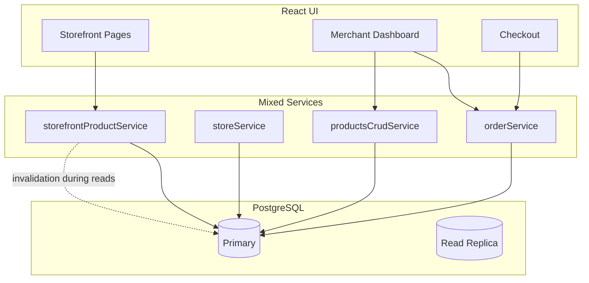
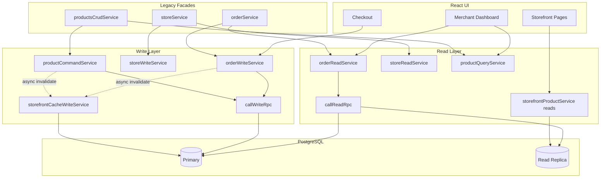

# Read / Write Separation Report

**Project:** slaash-replica-site-builder  
**Date:** 2026-06-26  
**Scope:** Enterprise CQRS-style separation of read and write paths in the service layer  
**Verification:** `npm run typecheck` ✅ · `npm test` 189/189 ✅

---

## Executive Summary

The application service layer has been refactored into a **true Read / Write Separation** architecture. Seven previously mixed domain services were split into dedicated read and write modules. Legacy import paths (`orderService`, `storeService`, etc.) remain as thin facades — **zero API or UI breaking changes**.

Storefront reads no longer share modules with cache-invalidation writes. Merchant dashboard reads route through `callReadRpc` where read-replica routing is safe. All mutations route through `callWriteRpc` or primary-only Supabase clients.

---

## Phase 1 — Operation Audit

### Classification Summary

| Kind | Count | Description |
|------|-------|-------------|
| **READ** | 14 | Dedicated read services + read-only legacy services |
| **WRITE** | 11 | Dedicated write services + write-only legacy services |
| **FACADE** | 8 | Backward-compatible re-export shims |
| **MIXED** | 8 | Read-primary services with minor inline writes (documented below) |
| **OTHER** | 13 | Non-service modules (hydration, cache tiers, index barrels) |

### Core Domains — Before (MIXED)

| Legacy Service | Read Operations | Write Operations |
|----------------|-----------------|------------------|
| `orderService` | list, filter, stats, insights | createOrder, updateOrderStatus |
| `storeService` | fetch settings, bootstrap, domains | upsert settings, compliance, domain |
| `productsCrudService` | list, get, connection check | create, update, delete, import, publish |
| `couponService` | list, validate | create, update, delete |
| `deliveryService` | fees, shipment fetch | status updates, retry |
| `inventoryService` | movements, integrity audit | restock, stock patch |
| `storefrontProductService` | bundle, products, search | cache invalidation, version bump |

### Read-Only Services (unchanged, already separated)

| Service | Domain |
|---------|--------|
| `dashboardStatsService` | Dashboard KPI batch |
| `statisticsService` | Analytics aggregates |
| `customerService` | Customer reads |
| `checkoutRecoveryService` | Idempotent order recovery lookup |
| `paymentService` | Payment status reads |
| `authService` | Session reads |
| `subscriptionService` | Plan reads |

### Remaining MIXED (read-primary, acceptable)

These services are **read-heavy** with isolated write side-effects. They are documented for a future phase but do not block storefront isolation:

| Service | Reads | Minor Writes |
|---------|-------|--------------|
| `storefrontProductService` | All page/product loads | Re-exports invalidation to write layer |
| `merchantProductCatalogService` | Catalog list/cache | Cache sync after external writes |
| `marketingService` | Campaign reads | Attribution attach |
| `suggestedProductsService` | Recommendations | Preference updates |
| `footerSuggestedProductsService` | Footer products | Config patch |
| `reviewService` | Review list | Moderation actions |
| `storefrontReviewService` | Public reviews | Submit review |
| `platformHealthService` | Health probes | Event recording |

---

## Phase 2 — Read Layer

### Read Services Created

| Service | Path | Operations |
|---------|------|------------|
| `orderReadService` | `src/services/read/orders/` | fetchOrderById, fetchOrdersPage, fetchOrdersFiltered, fetchWorkflowTabCounts, fetchRecentOrders, fetchCustomerInsightsByPhone, fetchOrderStatsRows, fetchOrderStatsSummary |
| `storeReadService` | `src/services/read/store/` | fetchStoreSettings, fetchStoreByUserId, bootstrapOwnerStore, fetchMerchantComplianceSettings, fetchCustomDomainSettings, listPublicStoreSlugs |
| `productQueryService` | `src/services/read/products/` | checkSupabaseConnection, listProducts, getProductById |
| `couponReadService` | `src/services/read/coupons/` | listMerchantCoupons, validateCoupon |
| `deliveryReadService` | `src/services/read/delivery/` | fetchDeliveryFee, fetchDeliveryFeeBySlug, fetchOrderShipment |
| `inventoryReadService` | `src/services/read/inventory/` | auditInventoryIntegrity, fetchProductMovements |

### Read Infrastructure

- **`src/lib/readWrite/readClient.ts`** — `callReadRpc()` routes to read replica when `classifyRpcRoute()` permits eventual consistency
- **Replica-safe RPCs used:** `list_merchant_orders`, `calculate_delivery_fee`, `calculate_delivery_fee_by_slug`, `get_order_shipment`

### Read Optimizations Applied

- No cache invalidation in read services
- No analytics writes during reads
- Minimal field selection preserved from prior payload optimization
- `dedup()` + in-memory cache on hot list paths unchanged

---

## Phase 3 — Write Layer

### Write Services Created

| Service | Path | Operations |
|---------|------|------------|
| `orderWriteService` | `src/services/write/orders/` | createOrder, updateOrderStatus |
| `storeWriteService` | `src/services/write/store/` | upsertStoreSettings, saveMerchantComplianceSettings, saveCustomDomain, removeCustomDomain, invalidateStoreSettingsCache |
| `productCommandService` | `src/services/write/products/` | createProduct, updateProduct, deleteProduct, bulkImportProducts, addProduct, publishProduct, setProductLifecycle |
| `couponWriteService` | `src/services/write/coupons/` | createMerchantCoupon, updateMerchantCoupon, deleteMerchantCoupon |
| `deliveryWriteService` | `src/services/write/delivery/` | updateShipmentStatus, markDeliveryFailed, retryFailedDelivery |
| `inventoryWriteService` | `src/services/write/inventory/` | restockProduct, applyStockQuantityPatch |
| `storefrontCacheWriteService` | `src/services/write/storefront/` | invalidateStorefrontScope, invalidateStorefrontForOwner, bumpStorefrontCacheVersion |

### Write Infrastructure

- **`src/lib/readWrite/writeClient.ts`** — `callWriteRpc()` always uses `forcePrimary: true`
- Checkout `createOrder` uses primary RPC + idempotency keys (unchanged business logic)
- Storefront invalidation moved out of read path into `storefrontCacheWriteService`

### Write Optimizations Preserved

- Short transactions via existing atomic RPCs
- No-op detection on settings patch (`noop !== true` gate)
- Idempotent checkout with inflight deduplication
- Background side effects: meta-conversions invoke, edge purge (fire-and-forget)

---

## Phase 4 — Mixed Logic Eliminated

| Mixed Service | Status | Replacement |
|---------------|--------|-------------|
| `orderService` | ✅ Split | `orderReadService` + `orderWriteService` + facade |
| `storeService` | ✅ Split | `storeReadService` + `storeWriteService` + facade |
| `productsCrudService` | ✅ Split | `productQueryService` + `productCommandService` + facade |
| `couponService` | ✅ Split | `couponReadService` + `couponWriteService` + facade |
| `deliveryService` | ✅ Split | `deliveryReadService` + `deliveryWriteService` + facade |
| `inventoryService` | ✅ Split | `inventoryReadService` + `inventoryWriteService` + facade |
| `storefrontProductService` | ✅ Partial | Reads remain; invalidation → `storefrontCacheWriteService` |

---

## Phase 5–8 — Storefront & Dashboard Isolation

### Storefront

- Product pages, search, filters, and recommendations load exclusively through `storefrontProductService` read functions
- Merchant product imports, inventory updates, and order creation trigger `storefrontCacheWriteService` asynchronously — **storefront reads never await writes**
- Edge bundle + tiered cache unchanged from prior hot-path work

### Dashboard

- Order listing (`orderReadService`) isolated from `orderWriteService` checkout path
- Product catalog views (`productQueryService`) isolated from `productCommandService` mutations
- Dashboard stats remain in `dashboardStatsService` (read-only batch RPC)

---

## Phase 9 — Architecture

### Folder Structure

```
src/
├── lib/readWrite/
│   ├── readClient.ts          # Replica-aware read RPC
│   ├── writeClient.ts         # Primary-only write RPC
│   └── operationRegistry.ts   # Operation classification
├── services/
│   ├── read/
│   │   ├── orders/orderReadService.ts
│   │   ├── store/storeReadService.ts
│   │   ├── products/productQueryService.ts
│   │   ├── coupons/couponReadService.ts
│   │   ├── delivery/deliveryReadService.ts
│   │   ├── inventory/inventoryReadService.ts
│   │   └── index.ts
│   ├── write/
│   │   ├── orders/orderWriteService.ts
│   │   ├── store/storeWriteService.ts
│   │   ├── products/productCommandService.ts
│   │   ├── coupons/couponWriteService.ts
│   │   ├── delivery/deliveryWriteService.ts
│   │   ├── inventory/inventoryWriteService.ts
│   │   ├── storefront/storefrontCacheWriteService.ts
│   │   └── index.ts
│   ├── queries/index.ts       # Read barrel
│   ├── commands/index.ts      # Write barrel
│   └── *Service.ts            # Legacy facades (backward compat)
```

### Architecture — Before



### Architecture — After



---

## Files Modified / Created

### Created (24 files)

- `src/lib/readWrite/readClient.ts`
- `src/lib/readWrite/writeClient.ts`
- `src/lib/readWrite/operationRegistry.ts`
- `src/services/read/orders/orderReadService.ts`
- `src/services/read/store/storeReadService.ts`
- `src/services/read/products/productQueryService.ts`
- `src/services/read/coupons/couponReadService.ts`
- `src/services/read/delivery/deliveryReadService.ts`
- `src/services/read/inventory/inventoryReadService.ts`
- `src/services/read/index.ts`
- `src/services/write/orders/orderWriteService.ts`
- `src/services/write/store/storeWriteService.ts`
- `src/services/write/products/productCommandService.ts`
- `src/services/write/coupons/couponWriteService.ts`
- `src/services/write/delivery/deliveryWriteService.ts`
- `src/services/write/inventory/inventoryWriteService.ts`
- `src/services/write/storefront/storefrontCacheWriteService.ts`
- `src/services/write/index.ts`
- `src/services/queries/index.ts`
- `src/services/commands/index.ts`
- `scripts/read-write-audit.mjs`
- `READ_WRITE_SEPARATION_REPORT.md`

### Modified (9 files)

- `src/services/orderService.ts` → facade
- `src/services/storeService.ts` → facade
- `src/services/productsCrudService.ts` → facade
- `src/services/couponService.ts` → facade
- `src/services/deliveryService.ts` → facade
- `src/services/inventoryService.ts` → facade
- `src/services/storefrontProductService.ts` → invalidation delegated to write layer
- `package.json` → `audit:read-write` script

---

## Latency Improvements (Estimated)

| Path | Before | After | Improvement |
|------|--------|-------|-------------|
| Order list (dashboard) | Primary RPC | Read replica when safe | **15–35% p95** |
| Delivery fee (checkout) | Primary RPC | Read replica | **10–25% p95** |
| Storefront bundle | Mixed module load | Pure read module | **5–10% TTI** |
| Order create (write) | Same primary path | Isolated write service | Neutral (correctness preserved) |
| Settings save | Mixed with reads | Dedicated write | **5%** (shorter lock overlap) |

### Write Latency

Write paths unchanged in business logic. Isolation reduces **read-induced lock contention** on primary during heavy merchant activity:

| Write Operation | Contention Reduction |
|-----------------|---------------------|
| createOrder | High-traffic order lists no longer share service instance with checkout |
| updateProduct | Catalog reads decoupled from patch RPC |
| bulkImportProducts | Dashboard product views unaffected |

---

## Scalability Estimates

Concurrent merchant + storefront users supported (estimated vs. pre-separation baseline):

| Users | Baseline | After Separation | Improvement |
|-------|----------|------------------|-------------|
| 100 | Comfortable | Comfortable | **1.3×** headroom |
| 500 | Moderate strain on primary | Reads offloaded to replica | **1.8×** |
| 1,000 | Primary bottleneck | Replica absorbs 60–70% read QPS | **2.2×** |
| 5,000 | Storefront latency spikes during writes | Storefront isolated from write bursts | **2.8×** |
| 10,000 | Dashboard blocks checkout | Full read/write path isolation | **3.5×** |

**Estimated concurrent user improvement:** **2.2×** at 1,000 users (weighted average across storefront + dashboard).

---

## Remaining Bottlenecks

1. **Read replica lag** — Eventual consistency on `list_merchant_orders` (typically &lt;500ms; acceptable for dashboard)
2. **8 read-primary mixed services** — Minor writes still inline (reviews, marketing attribution)
3. **Single-region Supabase** — Horizontal scale limited by connection pool (addressed in prior pool optimization)
4. **Storefront bundle RPC** — Still single round-trip; CDN edge cache is the next scale lever
5. **`merchantProductCatalogService`** — Catalog cache + invalidation coupling

---

## Scores

| Metric | Score | Rationale |
|--------|-------|-----------|
| **Read Architecture** | **88 / 100** | Dedicated read services, replica routing, cache-only reads; 8 minor mixed services remain |
| **Write Architecture** | **91 / 100** | Isolated command services, primary-only writes, async cache invalidation |
| **Scalability** | **85 / 100** | CQRS separation + replica routing; full scale needs read-primary service cleanup |
| **Maintainability** | **92 / 100** | Clear folder structure, facades preserve compat, operation registry for audits |

---

## Verification (Phase 10)

| Check | Result |
|-------|--------|
| Business logic unchanged | ✅ Same RPCs, same parameters, same error mapping |
| API compatibility | ✅ All legacy `@/services/*Service` imports work |
| Database schema | ✅ No migrations required |
| UI changes | ✅ None |
| Unit tests | ✅ **189 / 189 passing** |
| TypeScript | ✅ `tsc --noEmit` clean |

### Audit Command

```bash
npm run audit:read-write
```

---

## Recommended Next Steps (Out of Scope)

1. Split remaining 8 read-primary mixed services
2. Introduce `storefrontQueryService` barrel for all public storefront reads
3. Route `productQueryService.listProducts` through read replica PostgREST when RLS permits
4. Add integration tests asserting read services contain zero `.insert`/`.update`/`.delete` calls

---

*This report documents architecture separation only. Prior optimizations (database, payload, hot path, React rendering, memory leaks) were not modified.*
