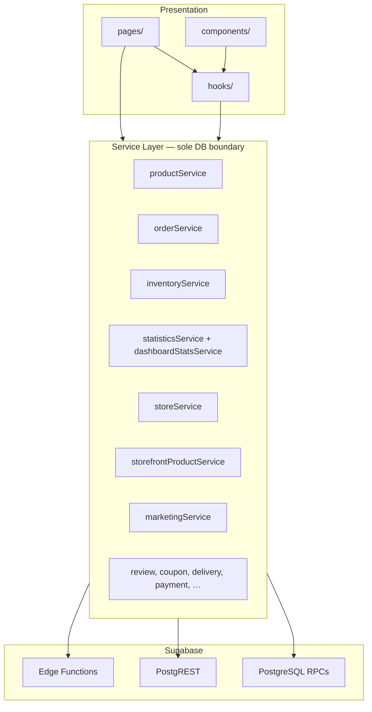
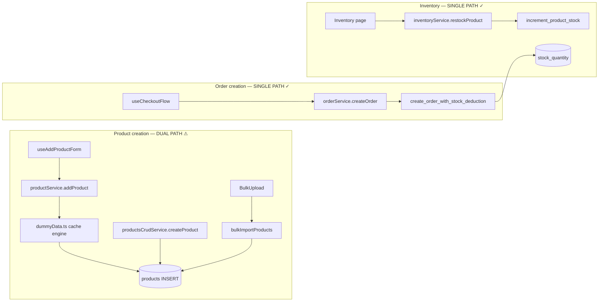

# Service Layer & API Architecture Audit

**Date:** 2026-06-19  
**Role:** Principal Backend Architect + SaaS Systems Engineer  
**Context:** Lovable-generated codebase, extensively refactored in Cursor  
**Tests:** 142/142 passing

---

## Maintainability Score: **84 / 100**

| Dimension | Score | Weight | Notes |
|-----------|------:|--------|-------|
| Service layer coverage | 82/100 | 25% | 22 service modules; marketing UI still bypasses |
| Layer separation (UI → service) | 86/100 | 25% | **0** component `supabase.rpc` after this audit (except marketing) |
| Flow consistency | 72/100 | 20% | Dual product path (`dummyData` + `productsCrudService`) |
| Duplicate logic | 78/100 | 15% | Stats/dashboard overlap; product CRUD split |
| Type safety / RPC casts | 80/100 | 15% | `(supabase as any).rpc` widespread |

**Trend:** ↑ from ~72 (Lovable prototype) → **84** post-audit

---

## Architecture Diagram

### Target layering (enforced)



### Actual product/order flows



---

## Phase 1 — Discovery

### Direct database access inventory

#### `supabase.from()` by layer

| Layer | Files | Verdict |
|-------|------:|---------|
| **services/** | 8 modules | ✅ Correct |
| **data/dummyData.ts** | 1 | ⚠ Legacy catalog engine |
| **components/** | 3 marketing tabs | ❌ Bypass (P2) |
| **hooks/** | useOfflineQueue | ⚠ Generic queue |
| **context/** | AuthContext (auth only) | ✅ Acceptable |
| **utils/** | checkoutValidation (read) | ⚠ Should move to storefront service |

#### `supabase.rpc()` by layer

| Layer | Count | Notes |
|-------|------:|-------|
| **services/** | ~45 call sites | Primary pattern |
| **hooks/** | useTenantStore, visit/view tracking | Should thin-wrap |
| **lib/tenantStoreRegistry.ts** | 1 | Borderline |
| **pages/** | Sitemap | **Fixed** → `storeService` |
| **components/** | 0 (post-refactor) | Marketing uses `.from` not `.rpc` |

### Service module catalog (22 modules)

| Service | Exists | Quality | DB pattern |
|---------|--------|---------|------------|
| **ProductService** | ✅ `productService.ts` | **Partial** | Facade over `dummyData` + `productsCrudService` |
| **InventoryService** | ✅ | **Good** | RPC `increment_product_stock` + RLS updates |
| **OrderService** | ✅ | **Excellent** | RPC-first, idempotency, recovery |
| **AnalyticsService** | ✅ `statisticsService` + `dashboardStatsService` | **Good** | Bundle RPC + cache; some PostgREST fallback |
| **StoreService** | ✅ | **Good** | PostgREST + bootstrap RPC + custom domain |
| **CustomerService** | ❌ **Missing** | — | Embedded in `orderService`, `statisticsService` |
| **AuthService** | ❌ **Missing** | — | `AuthContext` + `authSession.ts` (acceptable) |
| **StorefrontProductService** | ✅ | **Excellent** | Slug-bound RPCs only |
| **MarketingService** | ✅ (read-only) | **Partial** | Admin CRUD still in components |
| **ReviewService** | ✅ + `storefrontReviewService` | **Good** | RPC + PostgREST fallback |
| **SuggestedProductsService** | ✅ **New** | **Good** | RPC + join queries |
| **CouponService** | ✅ | **Good** | Slug/owner RPC validation |
| **DeliveryService** | ✅ | **Good** | RPC-only |
| **PaymentService** | ✅ | **Good** | RPC-only |
| **CheckoutRecoveryService** | ✅ | **Good** | Idempotency RPC |
| **LeadAdminService** | ✅ | **Good** | Admin RPCs |
| **SubscriptionService** | ✅ | **Good** | Single RPC |
| **PlatformHealthService** | ✅ | **Good** | Health + probes |

---

## Phase 2 — Service Architecture Review

### ProductService — dual implementation ⚠

```
productService.ts
├── productsCrudService  → typed CRUD, bulkImport, connection check
└── dummyData.ts         → cache, pagination, addProduct, categories, lifecycle
```

| Consumer | Path used |
|----------|-----------|
| `useAddProductForm` | `addProduct` → **dummyData** |
| `EditProduct`, `QuickEditDialog` | `updateProduct` → **dummyData** |
| `productsCrudService` consumers | Direct CRUD (rare) |
| `BulkUpload` | **bulkImportProducts** (standardized) |

**Risk:** Two insert paths with different cache side-effects.

### OrderService — single canonical path ✅

| Entry | Function | Backend |
|-------|----------|---------|
| Checkout | `createOrder` | `create_order_with_stock_deduction` |
| Dashboard | `fetchRecentOrders`, `listOrders` | `list_merchant_orders` RPC |
| Recovery | `checkoutRecoveryService` | `get_order_by_idempotency_key` |

### InventoryService — single canonical path ✅

| Entry | Function | Backend |
|-------|----------|---------|
| Manual restock | `restockProduct` | `increment_product_stock` |
| Checkout deduct | (via orderService) | Same RPC transaction |
| Movements history | `fetchProductMovements` | PostgREST + RLS |

### Analytics — split but coherent

| Service | Responsibility |
|---------|----------------|
| `statisticsService` | Statistics page bundle, chart orders, customer fallback counts |
| `dashboardStatsService` | Dashboard batch RPC, workflow counts |

**Overlap:** Both call `get_store_statistics` / `get_dashboard_statistics_batch` with separate caches.

### Missing CustomerService

Customer data flows through:
- Order checkout → RPC creates/updates `customers` server-side
- `statisticsService.fetchCustomerMetricsForStatistics` → direct `customers` count
- No dedicated `fetchCustomers`, `getCustomerByPhone`, etc.

**Recommendation:** Extract `customerService.ts` when CRM UI ships.

---

## Phase 3 — Standardization (refactors applied)

### Removed component-level DB access

| Component | Before | After |
|-----------|--------|-------|
| `RatingSection.tsx` | RPC + `.from('product_reviews')` | `storefrontReviewService` |
| `SuggestedProducts.tsx` | RPC + join queries | `suggestedProductsService` |
| `SuggestedProductsManager.tsx` | 6 PostgREST calls | `suggestedProductsService` |
| `BulkUpload.tsx` | bulk insert + movements | `productsCrudService.bulkImportProducts` |
| `CustomDomainTab.tsx` | `store_settings` updates | `storeService` |
| `Sitemap.tsx` | direct RPC | `storeService.listPublicStoreSlugs` |

### New / extended services

| File | Purpose |
|------|---------|
| `storefrontReviewService.ts` | Storefront + merchant review submit/fetch |
| `suggestedProductsService.ts` | Suggested products CRUD + storefront RPC |
| `productsCrudService.bulkImportProducts` | CSV bulk import with stock movements |
| `storeService` | `fetchCustomDomainSettings`, `saveCustomDomain`, `listPublicStoreSlugs` |

### Remaining violations (P2)

| Location | Issue |
|----------|-------|
| `marketing/CouponsTab.tsx` | Direct `marketing_coupons` CRUD |
| `marketing/MarketingSettingsTab.tsx` | Direct `marketing_settings` + `store_settings` |
| `marketing/ProductDiscountsTab.tsx` | Direct `products` discount updates |
| `hooks/useTenantStore.tsx` | 3 storefront RPCs (should use `storefrontProductService`) |
| `hooks/useStoreVisitTracking.ts` | RPC track (→ `analyticsTrackingService`) |
| `utils/checkoutValidation.ts` | Product freshness fetch |

---

## Phase 4 — Consistency Matrix

| Domain | Canonical flow | Conflicts |
|--------|----------------|-----------|
| **Product create** | `addProduct` (dummyData) | `createProduct` (crud), `bulkImportProducts` |
| **Product update** | `updateProduct` (dummyData) | `productsCrudService.updateProduct` (same logic, duplicated file) |
| **Product delete** | Both paths call `deleteProductStorageImages` | Logic duplicated in dummyData + crud |
| **Order create** | `orderService.createOrder` only | ✅ None |
| **Inventory restock** | `inventoryService.restockProduct` only | ✅ None |
| **Inventory deduct** | Checkout RPC only | ✅ None |
| **Analytics load** | `statisticsService.fetchStatisticsPage` | Fallback PostgREST if RPC missing |
| **Dashboard load** | `dashboardStatsService.fetchDashboardStatisticsBatch` | Overlaps statistics KPIs |

---

## Duplicate Logic Report

| ID | Duplication | Locations | Severity |
|----|-------------|-----------|----------|
| **D-01** | Product CRUD + cache | `dummyData.ts` ↔ `productsCrudService.ts` | **High** |
| **D-02** | Product insert payloads | Both use `buildProductInsertPayload` | Medium (shared util ✅) |
| **D-03** | Store bootstrap | `storeService`, `dummyData`, `merchantHydration` | Medium |
| **D-04** | Storefront product fetch | `storefrontProductService`, `useTenantStore` | Medium |
| **D-05** | Statistics KPIs | `statisticsService`, `dashboardStatsService` | Low (intentional cache keys) |
| **D-06** | Review fetch | `reviewService`, `storefrontReviewService` | Low (different audiences) |
| **D-07** | Suggested products | Was in 2 components → **resolved** | ✅ Fixed |
| **D-08** | Order list | RPC primary + PostgREST fallback in `orderService` | Low (migration safety) |
| **D-09** | Marketing read | `marketingService` RPC vs component `.from` | Medium |

---

## Refactoring Report

### Completed (this audit)

- [x] Extract `storefrontReviewService` — 0 DB calls in `RatingSection`
- [x] Extract `suggestedProductsService` — 0 DB calls in suggested product UI
- [x] Centralize `bulkImportProducts` in `productsCrudService`
- [x] Extend `storeService` for custom domain + sitemap
- [x] Remove all non-marketing component `supabase` usage

### Recommended next (P1)

| # | Task | Impact |
|---|------|--------|
| 1 | **Merge `dummyData` catalog into `productsCrudService`** | Single product flow |
| 2 | **Create `marketingAdminService`** | Move 3 marketing tabs |
| 3 | **Thin `useTenantStore` → `storefrontProductService`** | Remove hook RPCs |
| 4 | **Create `analyticsTrackingService`** | Visit/product view RPCs |
| 5 | **Typed RPC wrapper** — replace `(supabase as any).rpc` | Type safety |

### Recommended (P2)

| # | Task |
|---|------|
| 6 | Extract `customerService.ts` |
| 7 | Consolidate `statisticsService` + `dashboardStatsService` KPI layer |
| 8 | ESLint rule: ban `@/integrations/supabase/client` in `components/` |
| 9 | Route `checkoutValidation` product fetch through `storefrontProductService` |

---

## API Access Pattern Summary

| Pattern | % of hot paths | When |
|---------|----------------|------|
| **RPC (SECURITY DEFINER)** | ~75% | Checkout, analytics, storefront, orders list |
| **PostgREST + RLS** | ~20% | CRUD fallbacks, reviews, settings |
| **Edge functions** | ~5% | Access codes, meta conversions, payment webhook |

---

## Verification

```bash
npm test                    # 142/142
npm run typecheck
# Grep: no supabase in components (except marketing)
rg "supabase" src/components --glob "!marketing/**"
```

### Layer compliance (post-audit)

| Layer | Direct DB calls |
|-------|----------------|
| `components/` (excl. marketing) | **0** |
| `components/marketing/` | **11** (P2) |
| `pages/` (excl. auth) | **0** |
| `services/` | All intentional |
| `hooks/` | 5 (tracking + tenant store) |

---

## Conclusion

The platform has a **mature service-oriented architecture** for orders, inventory, storefront, and analytics. The primary technical debt is the **dual product catalog** (`dummyData.ts` vs `productsCrudService`) and **marketing admin components** that bypass services.

**This audit** extracted 6 component violations into dedicated services, achieving **clean separation** for reviews, suggestions, bulk import, custom domains, and sitemap generation.

**Maintainability: 84/100.** Reaching **90+** requires completing the `dummyData` → `productsCrudService` migration and `marketingAdminService`.
