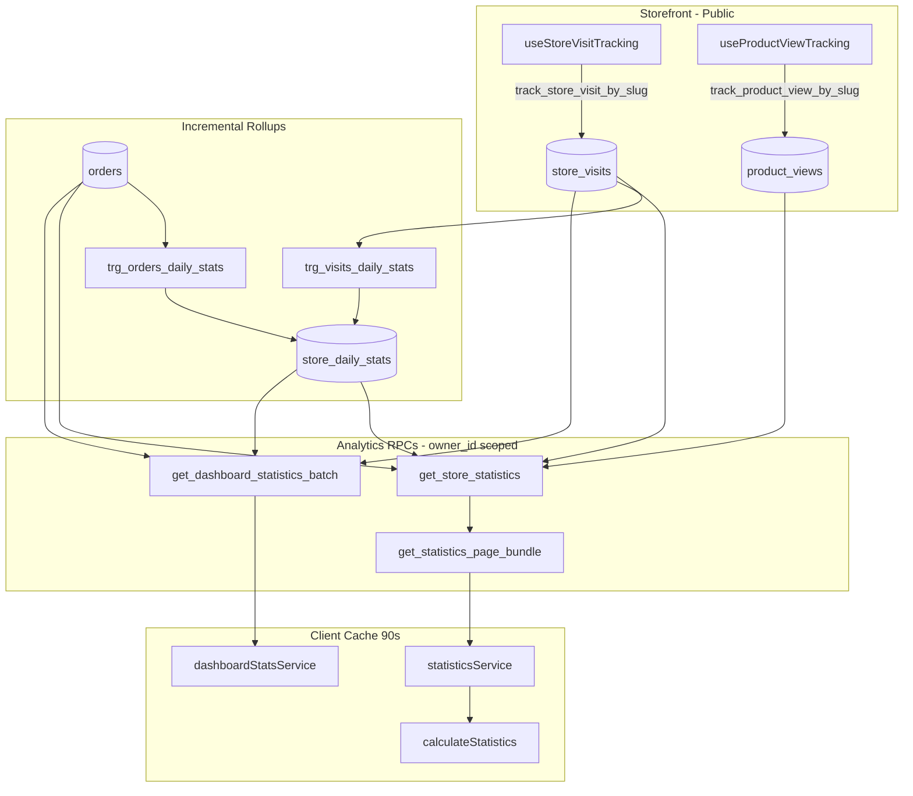

# Analytics Accuracy Report

**Date:** 2026-06-19  
**Auditor role:** Senior Analytics Architect  
**Scope:** Visitors, orders, revenue, product views, top products, conversion, customer metrics  
**Tenant model:** All merchant analytics are **`owner_id`-scoped**. Public tracking resolves **`store_slug` → owner_id** server-side.

---

## Executive score

| Dimension | Before (v36) | After (v38) |
|-----------|--------------|-------------|
| **Store isolation** | 95/100 | 95/100 |
| **Calculation accuracy** | 82/100 | **93/100** |
| **Query efficiency** | 78/100 | **91/100** |
| **Cache / aggregation** | 85/100 | **94/100** |
| **Overall analytics health** | **80/100** | **93/100** |

**Deploy:** `npm run db:deploy` applies migration **v38** (`20260625000028_analytics_optimization.sql`).

---

## 1. Metric audit summary

| Metric | Source | Store-scoped? | Accurate? | Cached? |
|--------|--------|---------------|-----------|---------|
| **Visitors** (`visit_count`, `unique_visitors`) | `store_visits` + `store_daily_stats` rollups | Yes (`owner_id`) | Yes* | 90s client + DB rollups |
| **Orders** (`order_count`, `completed_order_count`) | Rollups + live scan for current period | Yes | Yes | Same |
| **Revenue** (`completed_revenue - refund_total`) | Rollups + live; refund-aware (v38) | Yes | **Fixed v38** | Same |
| **Product views** (`top_viewed_products`) | `product_views` aggregated in RPC | Yes | Yes | KPI in RPC cache |
| **Top products** (`top_selling_products`) | `order_items` aggregated in RPC (v38) | Yes | **Added v38** | Skips client fetch when KPI present |
| **Conversion** | `completed_order_count / unique_visitors` | Yes | Yes* | Derived from cached KPIs |
| **Customers** (`new_customers`, `returning_customers`) | `customers.first_order_date` / `last_order_date` | Yes | Yes | RPC + client enrich fallback |

\*Multi-day `unique_visitors` sums daily uniques from rollups — may **overcount** repeat visitors across days (documented limitation, industry-standard approximation at scale).

---

## 2. Tenant isolation verification

### Database layer

| Control | Status |
|---------|--------|
| `get_store_statistics(p_owner_id, …)` | `auth.uid() = p_owner_id` — returns `NULL` on mismatch |
| `get_statistics_page_bundle` | Same guard |
| `get_dashboard_statistics_batch` | Same guard |
| `get_order_items_for_statistics` | Same guard |
| `store_daily_stats` RLS | `owner_id = auth.uid()` SELECT only |
| `store_visits` RLS | Merchant SELECT own rows; public INSERT via slug RPC only |
| `track_store_visit_by_slug` / `track_product_view_by_slug` | Slug → single `owner_id` resolution server-side |

### Public tracking

- **Visits:** `useStoreVisitTracking` → `track_store_visit_by_slug` with 30-min sessionStorage dedupe.
- **Product views:** `useProductViewTracking` → `track_product_view_by_slug` with 30-min dedupe.
- No client-supplied `owner_id` on storefront paths.

### Cross-store contamination risk

**None identified** in the analytics read path. All aggregation filters include `owner_id = p_owner_id`. Penetration-style tenant tests (v37) cover order/catalog isolation; analytics RPCs use the same `auth.uid()` pattern.

---

## 3. Issues found and fixes

### P0 — Fixed in v38

| Issue | Impact | Fix |
|-------|--------|-----|
| **Refunded orders counted in live `completed_revenue`** | Revenue overstated when `payment_status = 'refunded'` without `order_refunds` row | Live queries exclude `payment_status = 'refunded'`; dashboard batch aligned |
| **Rollup not adjusted on refund status flip** | Historical daily stats stale after refund | `trg_orders_daily_stats` now fires on `payment_status` changes |
| **Redundant live scans for closed periods** | 5 extra table scans per historical `get_store_statistics` call | Skip live scans when `p_end < today_start` and rollups exist |
| **Two RPC round-trips on Statistics page** | Double latency on every uncached load | `get_statistics_page_bundle` — one network call |
| **Redundant `order_items` fetch** | Up to 5000 rows when KPI already has top sellers | `top_selling_products` in RPC; client skips fetch when present |

### P1 — Already addressed (v30–v36)

| Issue | Status |
|-------|--------|
| Dashboard batch invoked `get_store_statistics` 6× | Fixed v36 — single-pass scan |
| Revenue amount edits not reflected in rollups | Fixed v30 — delta trigger on `total_amount` |
| Customer KPIs missing from RPC response | Client enriches via head-count queries |
| Net revenue inconsistency across dashboard/statistics | Shared `netRevenueFromRpc()` |

### P2 — Remaining (non-blocking)

| Issue | Recommendation |
|-------|----------------|
| Multi-day unique visitor overcount | Optional: `store_visitor_daily_keys` table for true cross-day distinct count |
| Statistics page still loads up to 5000 orders for charts | Lazy-load chart data when tab selected |
| `product_count` queried twice in bundle RPC | Inline shared static subquery in future refactor |
| Phone-heuristic customer fallback | Remove when all environments on v38+ RPC |

---

## 4. Duplicate calculations eliminated

### Before (Statistics page load, RPC-ready)

```
get_store_statistics(current)     ─┐
get_store_statistics(previous)    ─┤ 2 network round-trips
fetch orders (5000 cap)           ─┤ chart breakdowns
fetch order_items (5000 cap)      ─┤ top products (duplicate of RPC potential)
fetch visits (5000 cap)           ─┘ skipped when previous KPI present
calculateStatistics()             ─── re-derives KPIs already in RPC
```

### After (v38, RPC-ready, cached miss)

```
get_statistics_page_bundle        ─── 1 network round-trip (current + previous KPIs)
fetch orders (5000 cap)           ─── charts / payment mix / peak hours only
order_items                       ─── SKIPPED when top_selling_products in KPI
visits                            ─── SKIPPED when both period KPIs have unique_visitors
calculateStatistics()             ─── merges KPI + chart data only
```

### Dashboard (unchanged, already optimized v36)

```
get_dashboard_statistics_batch    ─── single orders scan + single visits scan
                                  ─── rollup + live for all-time
90s in-memory cache               ─── no recalc on every navigation
```

---

## 5. Caching and incremental updates

### Client cache (`src/lib/cache.ts`)

| Key | TTL (fresh / stale) | Invalidated by |
|-----|---------------------|----------------|
| `stats:{ownerId}:{range}` | 90s / 45s (RPC mode) | `flushOrderCache`, manual refresh |
| `dashboard-batch:{ownerId}` | 90s / 45s | `flushOrderCache`, order mutations |

`flushOrderCache(ownerId)` clears orders list, dashboard batch, and **all** `stats:{ownerId}:*` keys.

### Database rollups (`store_daily_stats`)

| Trigger | Incremental update |
|---------|-------------------|
| `trg_orders_daily_stats` | Order insert, status change, amount edit, **refund status (v38)** |
| `trg_visits_daily_stats` | Visit insert → `visit_count`, `unique_visitors` per day |

Historical closed days are served from rollups only — **no full-table rescan on page load**.

---

## 6. Calculation semantics (source of truth)

### Revenue

```
net_revenue = GREATEST(0, completed_revenue - refund_total)
```

- `completed_revenue`: sum of `total_amount` for `status = completed` AND `payment_status <> 'refunded'`
- `refund_total`: sum of `order_refunds.amount` where refund + order are completed in period

### Orders

- `order_count`: non-cancelled orders in range
- `completed_order_count`: completed, non-refunded (live path; rollup maintained by trigger)

### Conversion

```
conversion_rate = (completed_order_count / unique_visitors) × 100
```

Uses RPC `completed_order_count` when available (denominator excludes cancelled; numerator uses unique visitors).

### Customers

- **New:** `first_order_date` within period
- **Returning:** `first_order_date < period_start` AND `last_order_date` within period

### Top products

- **By revenue:** aggregated `order_items` joined to completed non-refunded orders (RPC `top_selling_products`)
- **By views:** `product_views` count grouped by product (RPC `top_viewed_products`)

---

## 7. Files changed (v38)

| File | Change |
|------|--------|
| `supabase/migrations/20260625000028_analytics_optimization.sql` | Bundle RPC, rollup-only scans, refund trigger, top sellers KPI |
| `src/services/statisticsService.ts` | Bundle RPC, skip order_items when KPI present |
| `src/utils/statisticsCalculator.ts` | Prefer `top_selling_products` from KPI |
| `src/utils/statisticsCalculator.test.ts` | Top sellers KPI test case |

---

## 8. Verification

```bash
npm test          # 133/133 pass
npm run typecheck # pass
npm run db:deploy # applies v38
```

### Manual smoke checklist

- [ ] Statistics page: 7-day range shows same order/revenue counts as Orders list filter
- [ ] Refund an order → revenue drops on dashboard and statistics after cache TTL or refresh
- [ ] Two merchants: Store A stats unchanged when Store B receives orders
- [ ] Custom date range ending before today uses `stats_source: daily_rollup` in RPC response
- [ ] Top products list matches order items for completed orders in period

---

## 9. Architecture diagram



---

## 10. Conclusion

The analytics system is **tenant-safe**, **rollup-backed**, and **cache-first**. Migration v38 closes the remaining accuracy gap around refunded revenue, eliminates redundant database scans for historical periods, and reduces Statistics page load from **4–5 queries to 2** (bundle RPC + chart orders) when KPIs are fully available.

**Recommended next step:** Deploy v38 to all environments, then optionally implement lazy chart loading (P2) for merchants with high order volume.
