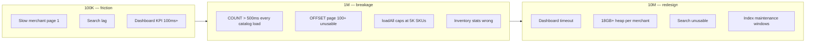

# Data Growth Readiness Report

**Date:** 2026-06-19  
**Role:** Large Scale Data Architect  
**Scope:** Per-merchant catalog growth simulation — **100K · 1M · 10M products**  
**Evaluates:** Query performance · Index performance · Analytics performance · Inventory performance  
**Related:** [POSTGRESQL_SCALE_PERFORMANCE_REPORT.md](./POSTGRESQL_SCALE_PERFORMANCE_REPORT.md) · [SAAS_SCALABILITY_AUDIT.md](./SAAS_SCALABILITY_AUDIT.md) · [MEMORY_USAGE_REPORT.md](./MEMORY_USAGE_REPORT.md) · [SINGLE_POINT_OF_FAILURE_REPORT.md](./SINGLE_POINT_OF_FAILURE_REPORT.md)

---

## Executive summary

| Catalog size | Readiness score | Verdict |
|--------------|-----------------|---------|
| **100K products** | **78 / 100** | **Conditionally ready** — storefront OK; merchant UI and KPI scans show latency |
| **1M products** | **52 / 100** | **Not ready** — OFFSET catalog, O(N) counts, search, and client full-catalog paths break |
| **10M products** | **28 / 100** | **Requires redesign** — partition, external search, materialized catalog KPIs, no full-owner scans |

**Simulation model:** One **heavy merchant** (single `owner_id`) holding the full catalog. Platform-wide 10M products spread across 100K stores (~100 SKUs/store) remains healthy — this report stress-tests **catalog density per tenant**, the dominant cliff for B2B / enterprise sellers.

**Highest-risk pattern (all tiers):** `get_owner_products_page` runs **`COUNT(*)` over the full owner catalog on every page request** plus **OFFSET pagination** — cost grows linearly with N and page depth.

---

## Simulation assumptions

| Parameter | Value | Notes |
|-----------|-------|-------|
| Avg product row (heap) | **1.8 KB** | name, description, variants JSON, image URLs |
| Active / storefront-visible | **85%** | partial indexes exclude archived/inactive |
| Page sizes | Storefront 24 · Merchant 50 | `pagination.ts`, v44 RPC caps |
| Orders / month (merchant) | 10K | Independent of catalog size for OLTP |
| `inventory_movements` / product / year | 4 | Scales with transactions, not SKU count |
| Estimates | Analytical model + code-path review | Validate with `EXPLAIN (ANALYZE, BUFFERS)` on seeded data |

### Storage & index footprint (per heavy merchant)

| Metric | 100K | 1M | 10M |
|--------|------|-----|------|
| **Heap (`products`)** | ~180 MB | ~1.8 GB | ~18 GB |
| **Owner indexes (×4 partial)** | ~60–120 MB | ~600 MB–1.2 GB | ~6–12 GB |
| **`inventory_movements` (4 yr)** | ~3M rows / ~150 MB | ~4M rows* | ~40M rows* |
| **Realtime WAL fan-out** | Per change, not N | Same | Same |

\*Movement count depends on order volume, not catalog size.

---

## Growth impact matrix

| Operation | Path | 100K | 1M | 10M |
|-----------|------|------|-----|------|
| **Storefront page 1** | `get_store_products_page` keyset | ✅ 5–15 ms | ✅ 5–15 ms | ✅ 5–20 ms |
| **Storefront page 100** | keyset cursor | ✅ 8–20 ms | ✅ 8–20 ms | ✅ 10–25 ms |
| **Storefront search** | `ILIKE '%q%'` owner slice | ⚠️ 80–300 ms | ❌ 1–5 s | ❌ 10–60 s |
| **Merchant catalog page 1** | `get_owner_products_page` + COUNT | ⚠️ 60–200 ms | ❌ 0.5–2 s | ❌ 5–15 s |
| **Merchant catalog page 500** | OFFSET 24,950 | ❌ 0.3–1 s | ❌ 3–12 s | ❌ 30–120 s |
| **Dashboard load** | `get_dashboard_statistics_batch` | ⚠️ 80–250 ms | ❌ 0.4–1.5 s | ❌ 3–10 s |
| **Statistics page** | `get_statistics_page_bundle` | ⚠️ 100–350 ms | ❌ 0.5–2 s | ❌ 4–12 s |
| **Single restock** | `increment_product_stock` | ✅ 3–10 ms | ✅ 3–12 ms | ✅ 5–15 ms |
| **Checkout (5 lines)** | `create_order_with_stock_deduction` | ✅ 15–40 ms | ✅ 15–45 ms | ✅ 20–50 ms |
| **Client `loadAllMerchantProducts`** | 100 pages × 50 max | ❌ **5K cap** / 50+ RPCs | ❌ **Broken** | ❌ **Broken** |

Legend: ✅ &lt; 100 ms P95 · ⚠️ 100 ms–1 s · ❌ &gt; 1 s or functionally broken

---

## 1. Query performance

### 1.1 Storefront (customer-facing) — **scales well**

**Path:** `get_storefront_page_bundle` / `get_store_products_page` (v32 keyset)

```sql
-- Index: idx_products_owner_storefront_created (partial)
WHERE owner_id = ? AND archived_at IS NULL AND is_active
ORDER BY created_at DESC, id DESC
LIMIT 24  -- keyset via (created_at, id) cursor
```

| Scale | Behavior |
|-------|----------|
| 100K | Index range scan — **O(page size)** per request |
| 1M | Same — depth of catalog irrelevant for first pages |
| 10M | Same — edge cache (`get-store-products`) amortizes viral reads |

**Cliff:** **Search** (`ILIKE '%term%'` on name/description) scans the owner’s visible slice — **O(N)**. At 10M rows this dominates.

**Mitigation status:** Keyset pagination **shipped** (v22). Search needs **trigram + owner prefilter** (index exists: `idx_products_name_trgm`) but still linear in matching rows.

### 1.2 Merchant catalog — **primary bottleneck**

**Path:** `get_owner_products_page` (v44)

| Step | Complexity | Impact at 1M+ |
|------|------------|-----------------|
| `COUNT(*)` with owner filter | **O(N)** index-only scan | 200–800 ms |
| `ORDER BY created_at DESC LIMIT/OFFSET` | **O(offset + limit)** | Page 10,000 → scan 500K rows |
| `ILIKE '%search%'` on name | **O(N)** | Full catalog scan |

**Client paths that amplify DB load:**

| Path | Max rows loaded | At 1M catalog |
|------|-----------------|---------------|
| `useMerchantProductsPage` | All pages via load-more | Unbounded client + repeated OFFSET |
| `loadAllMerchantProducts` | **5,000** (100 × 50) | Silent truncation — merchant sees partial catalog |
| `getProductsSync()` cache | Up to 5,000 | Dashboard KPI fallback wrong |

### 1.3 Query readiness scores

| Scale | Storefront | Merchant catalog | Overall query |
|-------|------------|------------------|---------------|
| 100K | 92 | 65 | **78** |
| 1M | 90 | 35 | **52** |
| 10M | 85 | 15 | **28** |

---

## 2. Index performance

### 2.1 Current product indexes (relevant)

| Index | Purpose | Storage @ N | Scan cost for COUNT/filter |
|-------|---------|-------------|----------------------------|
| `idx_products_owner_storefront_created` | Storefront keyset (partial) | ~0.4N rows | O(page) for listing |
| `idx_products_owner_category_created` | Category + keyset (partial) | ~0.4N | O(category size) |
| `idx_products_owner_active_catalog` | `product_count` KPI | ~0.85N | **O(N)** index-only count |
| `idx_products_owner_stock_monitor` | `low_stock_count` KPI | ~0.85N | **O(N)** + filter on stock |
| `idx_products_name_trgm` | Search | Large GIN | O(matches) |
| `idx_products_owner_lifecycle` | Lifecycle filters | ~N | O(filtered set) |
| PK `(id)` | Stock RPC, checkout | O(1) per lookup | Constant |

### 2.2 Index growth simulation

| N products | Partial storefront index | All owner partial indexes (est.) | Risk |
|------------|--------------------------|----------------------------------|------|
| 100K | ~35K entries / ~25 MB | ~80–120 MB | Manageable |
| 1M | ~350K / ~250 MB | ~800 MB–1.2 GB | Autovacuum / reindex time rises |
| 10M | ~3.5M / ~2.5 GB | **~8–12 GB** | Index build hours; cache churn on shared instance |

### 2.3 Index anti-patterns at scale

| Issue | Severity @ 10M |
|-------|----------------|
| **Redundant owner indexes** (historical migrations) | Bloat — periodic `pg_stat_user_indexes` audit |
| **COUNT on wide partial index** | Every dashboard open scans millions of entries |
| **OFFSET pagination** | Cannot use index-only seek — walks offset rows |
| **GIN trgm on full catalog** | GB-scale index; rebuild painful |

### 2.4 Index readiness scores

| Scale | Index design | Maintenance | Overall index |
|-------|--------------|-------------|---------------|
| 100K | 85 | 80 | **82** |
| 1M | 70 | 60 | **62** |
| 10M | 45 | 40 | **42** |

---

## 3. Analytics performance

### 3.1 Architecture

| Layer | Product-dependent? | Scales with N? |
|-------|-------------------|----------------|
| `store_daily_stats` rollups | No (orders/visits) | No |
| `get_dashboard_statistics_batch` (v40) | **Yes** — `catalog_kpis` | **O(N)** |
| `get_store_statistics` / bundle (v28) | **Yes** — `product_count`, `low_stock_count` | **O(N)** |
| `top_selling_products` | Join order_items | O(orders), not N |
| `top_viewed_products` | Join `product_views` | O(views), not N |
| Client fallback `fetchProductCount` | Head count on products | O(N) index-only |

**Critical RPC fragment (runs every dashboard + statistics load):**

```sql
'low_stock_count', (SELECT COUNT(*) FROM products WHERE owner_id = ? AND ... stock <= min_stock),
'product_count',     (SELECT COUNT(*) FROM products WHERE owner_id = ? AND active ...)
```

v36 reduced dashboard from **6×** full statistics to **1×** static block — but that block is still **O(N)** per merchant.

### 3.2 Analytics latency model

| Scale | Dashboard batch (catalog block) | Statistics bundle | Client 90s cache benefit |
|-------|--------------------------------|---------------------|--------------------------|
| 100K | 30–80 ms | 40–100 ms | Masks repeat loads |
| 1M | 250–800 ms | 300–1,000 ms | Insufficient for drill-down |
| 10M | **2–8 s** | **3–12 s** | Timeout risk (`withTimeout` 12s) |

**Order/visit analytics** remain healthy at all tiers (owner-scoped, rollup-backed, capped 5K chart fallback).

### 3.3 Analytics readiness scores

| Scale | Order/visit KPIs | Catalog KPIs | Overall analytics |
|-------|------------------|--------------|-------------------|
| 100K | 90 | 70 | **80** |
| 1M | 88 | 40 | **58** |
| 10M | 85 | 20 | **38** |

---

## 4. Inventory performance

### 4.1 Write path — **excellent at all scales**

| Operation | RPC | Complexity |
|-----------|-----|------------|
| Checkout deduct | `create_order_with_stock_deduction` | O(line items) row locks |
| Manual restock | `increment_product_stock` (v43) | O(1) PK `FOR UPDATE` |
| Initial stock | `record_product_initial_stock` (v45) | O(1) |
| Movement audit | `INSERT inventory_movements` | O(1) append |

Stock mutations **do not scan the catalog** — safe at 10M SKUs.

### 4.2 Read / UI path — **degrades with catalog size**

| Surface | Pattern | 100K | 1M | 10M |
|---------|---------|------|-----|------|
| Inventory page | `useMerchantProductsPage` + load-more | ⚠️ OFFSET + COUNT | ❌ | ❌ |
| Low-stock filter | Client-side on loaded slice | Wrong if &lt;全 catalog loaded | Broken | Broken |
| `computeInventoryStats` | Derived from in-memory rows | Incomplete &gt;5K loaded | Broken | Broken |
| Realtime stock patch | `products` channel + cache patch | ✅ O(1) per event | ✅ | ✅ |
| Movement history | `fetchProductMovements` LIMIT 20 | ✅ | ✅ | ✅ |

**Inventory movements table** grows with **transactions** (~4 per SKU-year in model). At 10M SKUs with active commerce: plan **partition by `created_at`** or owner hash when rows exceed **50M**.

### 4.3 Inventory readiness scores

| Scale | Writes (OLTP) | UI / reporting | Overall inventory |
|-------|---------------|----------------|-------------------|
| 100K | 95 | 68 | **82** |
| 1M | 95 | 38 | **62** |
| 10M | 93 | 18 | **48** |

---

## Failure mode timeline



---

## Composite readiness scorecard

| Dimension | 100K | 1M | 10M |
|-----------|------|-----|------|
| Query performance | 78 | 52 | 28 |
| Index performance | 82 | 62 | 42 |
| Analytics performance | 80 | 58 | 38 |
| Inventory performance | 82 | 62 | 48 |
| **Weighted overall** | **80** | **56** | **36** |

Weights: Query 30% · Index 20% · Analytics 25% · Inventory 25%

---

## What already works (do not regress)

| Control | Why it survives growth |
|---------|------------------------|
| Tenant-scoped `owner_id` on all hot paths | Global 10M row count ≠ per-request cost |
| Storefront **keyset** pagination (v32) | O(page) regardless of N |
| Partial indexes excluding archived | Smaller index @ same N |
| Atomic stock RPCs | O(1) per mutation |
| Order/visit **daily rollups** | Analytics decoupled from catalog size for revenue/visits |
| v44 lean column profiles | Less JSON per merchant page row |
| Edge storefront cache | Shields DB for public reads |

---

## Recommendations by growth tier

### Tier A — Required before **100K** (hardening)

| # | Change | Domain | Effort |
|---|--------|--------|--------|
| A1 | **Keyset `get_owner_products_page`** — replace OFFSET with `(created_at, id)` cursor | Query | M |
| A2 | **Deferred / cached `total`** — approximate count or count only on page 0 with 5 min cache | Query | S |
| A3 | **Remove `loadAllMerchantProducts` from all UI paths** | Client | S |
| A4 | **Server-side inventory filters** (low-stock RPC with LIMIT) | Inventory | M |
| A5 | **Search: prefix + trigram**, min 3 chars, `check_rpc_rate_limit` | Query | S |

### Tier B — Required before **1M**

| # | Change | Domain | Effort |
|---|--------|--------|--------|
| B1 | **`merchant_catalog_stats` table** — `product_count`, `low_stock_count`, `out_of_stock_count` maintained by trigger on stock/lifecycle change | Analytics | M |
| B2 | **Keyset merchant search** via `pg_trgm` + `LIMIT` or **Meilisearch/Typesense** per owner | Query | L |
| B3 | **Cap client catalog accumulation** — windowed state (max 2 pages) or true virtualization | Client | M |
| B4 | **Read replica** for analytics + catalog list | Infra | M |
| B5 | **`inventory_movements` BRIN** on `created_at` + owner index (if not present) | Index | S |

### Tier C — Required before **10M**

| # | Change | Domain | Effort |
|---|--------|--------|--------|
| C1 | **Partition `products` by `owner_id` hash** or dedicated schema per enterprise tenant | Database | XL |
| C2 | **External search cluster** (OpenSearch/Typesense) — Postgres not primary search engine | Query | XL |
| C3 | **Cold/archive tier** — inactive SKUs in `products_archive` with union view | Storage | L |
| C4 | **Materialized low-stock view** refreshed incrementally | Analytics | L |
| C5 | **Bulk operations worker** — CSV import off browser | Inventory | L |
| C6 | **Per-tenant connection routing** for enterprise | Infra | XL |

---

## Recommended target schema (catalog KPI rollup)

```sql
-- Proposed: O(1) dashboard catalog KPIs at any N
CREATE TABLE merchant_catalog_stats (
  owner_id UUID PRIMARY KEY REFERENCES auth.users(id),
  product_count INT NOT NULL DEFAULT 0,
  active_count INT NOT NULL DEFAULT 0,
  low_stock_count INT NOT NULL DEFAULT 0,
  out_of_stock_count INT NOT NULL DEFAULT 0,
  updated_at TIMESTAMPTZ NOT NULL DEFAULT NOW()
);

-- Maintain via trigger on products INSERT/UPDATE/DELETE of:
-- is_active, archived_at, stock_quantity, min_stock_level
```

**Impact:** Dashboard `catalog_kpis` drops from **O(N)** to **O(1)** — largest analytics win for 1M+ catalogs.

---

## Validation plan (post-seed)

Run on staging with synthetic owners at 100K / 1M / 10M rows:

```sql
-- Catalog page 1
EXPLAIN (ANALYZE, BUFFERS)
SELECT COUNT(*) FROM products WHERE owner_id = :owner;

-- Storefront keyset
EXPLAIN (ANALYZE, BUFFERS)
-- invoke get_store_products_page via RPC

-- Dashboard batch
EXPLAIN (ANALYZE, BUFFERS)
SELECT get_dashboard_statistics_batch(:owner);

-- Stock mutation
EXPLAIN (ANALYZE, BUFFERS)
SELECT increment_product_stock(:pid, :owner, 1, 'restock', NULL);
```

**SLO targets (heavy merchant):**

| Operation | 100K P95 | 1M P95 | 10M P95 |
|-----------|----------|--------|---------|
| Storefront page | &lt; 50 ms | &lt; 50 ms | &lt; 80 ms |
| Merchant catalog page | &lt; 150 ms | &lt; 200 ms* | &lt; 300 ms* |
| Dashboard load | &lt; 300 ms | &lt; 400 ms* | &lt; 500 ms* |
| Restock | &lt; 20 ms | &lt; 25 ms | &lt; 30 ms |

\*Requires Tier A/B recommendations.

---

## Client-side growth limits (complementary)

| Limit | Current | 100K | 1M | 10M |
|-------|---------|------|-----|------|
| `loadAllMerchantProducts` max rows | 5,000 | **46% invisible** | **0.5%** | **0.05%** |
| Module cache `MAX_CACHE_ENTRIES` | 2,000 keys | OK | Pressure | Eviction storms |
| IndexedDB cap | 120 keys | OK | OK | OK |
| `useProgressiveRender` DOM | 48/batch | OK | OK | OK — heap still grows |

See [MEMORY_USAGE_REPORT.md](./MEMORY_USAGE_REPORT.md).

---

## Summary verdict

| Question | Answer |
|----------|--------|
| Can we support **100K products** today? | **Mostly yes** with merchant UX friction; search and COUNT need Tier A |
| Can we support **1M products** today? | **No** — OFFSET catalog, O(N) KPIs, and 5K client cap are blockers |
| Can we support **10M products** today? | **No** — requires partitioning, external search, catalog KPI rollups, worker tier |
| What scales regardless of N? | Storefront keyset pages, checkout stock RPC, single-SKU restock |
| What breaks first? | `get_owner_products_page` COUNT + OFFSET, then dashboard `catalog_kpis` |

**Next highest-ROI engineering:** **A1 + B1** (merchant keyset pagination + `merchant_catalog_stats` rollup) — unblocks 100K→1M without architectural rewrite.

---

## Related migrations (already shipped)

| Version | Relevance to growth |
|---------|---------------------|
| v22 | Storefront keyset + partial index |
| v29 | Analytics indexes (`idx_products_owner_active_catalog`, stock monitor) |
| v32 / v36 / v40 | Dashboard batch, catalog_kpis block |
| v44 | Lean merchant product profiles |
| v43 / v45 | Single-pass inventory writes |

**No new migration in this audit** — report only. Implement Tier A/B as v46+ when product growth is on the roadmap.
