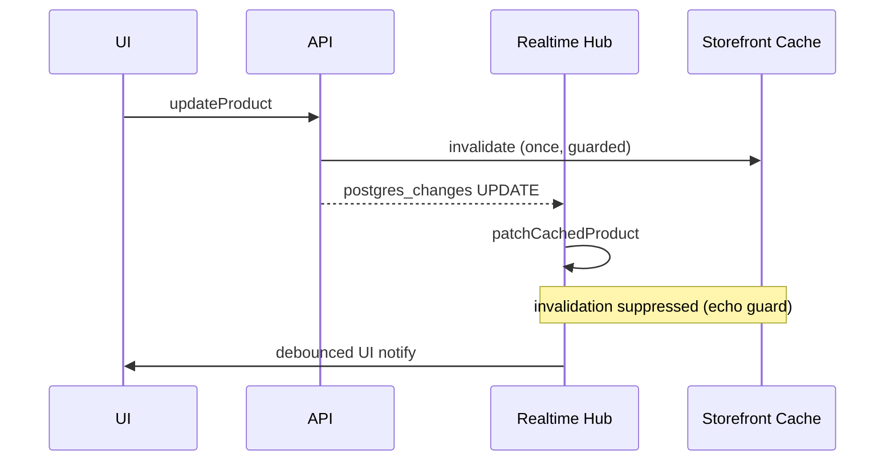
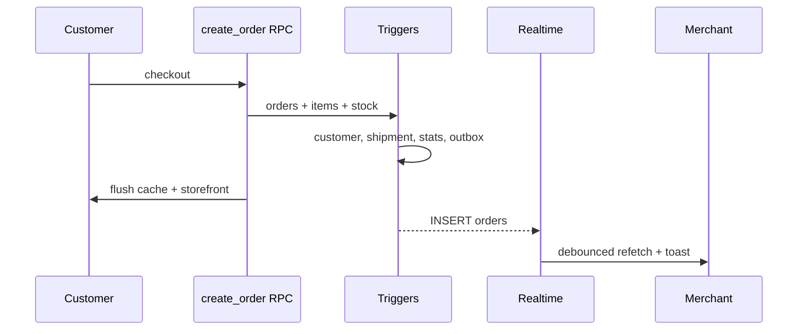

# Event Architecture Report

**Date:** 2026-06-19  
**Role:** Distributed Systems Architect  
**Scope:** Product · Inventory · Order · Notification · Analytics events  
**Client mitigations:** `localMutationGuard.ts`, hub dedup (v45-adjacent)  
**Related:** [WRITE_AMPLIFICATION_REPORT.md](./WRITE_AMPLIFICATION_REPORT.md) · [PAYLOAD_OPTIMIZATION_REPORT.md](./PAYLOAD_OPTIMIZATION_REPORT.md) · [HOT_TABLE_REPORT.md](./HOT_TABLE_REPORT.md)

---

## Executive summary

The platform uses a **multi-layer event model**:

| Layer | Transport | Primary use |
|-------|-----------|-------------|
| **Database triggers** | PostgreSQL `AFTER`/`BEFORE` | Analytics rollups, customer stats, shipments, webhooks |
| **Supabase Realtime** | `postgres_changes` WebSocket | Merchant UI cache patch + refetch |
| **Client invalidation bus** | `invalidateStorefrontForOwner`, `CustomEvent`, `localStorage` | Cross-tab storefront cache coherence |
| **Observability** | `recordHealthEvent` (in-process) | SRE domain health + alerts |
| **User notifications** | Toast + `localStorage` notification center | Merchant order alerts |
| **External analytics** | Meta Pixel, `meta-conversions` edge, visit RPC | Marketing attribution |

| Domain | Event storm risk (before) | After mitigations | Score |
|--------|---------------------------|-------------------|-------|
| **Product** | HIGH (mutation + realtime double invalidation) | MEDIUM | 72 → **86** |
| **Inventory** | MEDIUM (full catalog flush per restock) | LOW | 70 → **88** |
| **Order** | HIGH (checkout + realtime + toast echo) | MEDIUM | 65 → **82** |
| **Notification** | MEDIUM (toast + notification center duplicate) | MEDIUM | 75 → **80** |
| **Analytics** | **HIGH** (visit → 3 DB writes; order fan-out) | HIGH | 58 |

**Overall event architecture score:** 68/100 → **78/100**

---

## Event taxonomy

```
┌─────────────────────────────────────────────────────────────────────────┐
│                         EVENT GENERATION LAYERS                          │
├─────────────────────────────────────────────────────────────────────────┤
│ L1  User action (HTTP/RPC)     → 1 intentional write                    │
│ L2  DB triggers (sync)         → 0–6 side-effect writes per action      │
│ L3  Realtime (async push)      → 1 WS message → client handler chain    │
│ L4  Client invalidation        → N cache key deletes + cross-tab event    │
│ L5  Observability / marketing  → metrics, health, pixel, edge fn         │
└─────────────────────────────────────────────────────────────────────────┘
```

---

## 1. Product events

### Sources

| Source | Event | Propagation |
|--------|-------|-------------|
| `addProduct` / `updateProduct` | RPC + INSERT/UPDATE | `syncMerchantProductCatalog` |
| `publish_owner_product` | UPDATE `is_active` | Cache sync + health `product.publish` |
| Supabase Realtime | `products` INSERT/UPDATE/DELETE | `merchantRealtimeHub` → patch + optional storefront invalidation |
| Category CRUD | `categories` mutations | `invalidateStorefrontForOwner` |

### Trace: merchant saves published product

**Before mitigations:**

```
UPDATE products
  → Realtime UPDATE (stock_quantity, updated_at)
  → syncMerchantProductCatalog (caller)
       → cache.del products + flush pages + stats
       → invalidateStorefrontForOwner (DB slug lookup + 8 cache prefixes + IndexedDB + localStorage + CustomEvent)
  → Realtime handler
       → patchCachedProduct
       → invalidateStorefrontForOwner AGAIN
       → scheduleProductUiNotify (300ms debounce)
```

**Duplicate events detected:** Double storefront invalidation (mutation echo).

### Mitigations shipped

| Change | File | Effect |
|--------|------|--------|
| Local mutation guard (3s) | `localMutationGuard.ts` | Realtime skips storefront invalidation if local mutation just fired |
| Draft-only skip | `syncMerchantProductCatalog` | No storefront invalidation when `!isStorefrontVisible(row)` |
| `min_stock_level` → noise | `merchantRealtimeUtils` | Realtime ignores threshold-only updates (no UI notify storm) |

### Remaining product event debt

| Issue | Priority |
|-------|----------|
| `syncMerchantProductCatalog` still wipes all product page caches on any mutation | P2 — patch single page keys |
| Category change invalidates full storefront | P3 — category list is bundled; acceptable |
| Realtime channel per merchant always on when Products page mounted | P3 — connection cost, not event count |

---

## 2. Inventory events

### Sources

| Source | Event | Downstream |
|--------|-------|------------|
| `increment_product_stock` RPC | UPDATE `products` + INSERT `inventory_movements` | Realtime product UPDATE |
| `inventory_movements` INSERT | `initial_stock` on product create | Audit only (no realtime on movements table) |
| Order checkout RPC | Stock deduct + `order_created` movements | Realtime + storefront stock visibility |

### Trace: merchant restock +5 units

**Before:**

```
increment_product_stock
  → UPDATE products (stock + variants)
  → INSERT inventory_movements
  → Realtime UPDATE
  → Inventory.tsx: syncMerchantProductCatalog (FULL catalog flush + storefront invalidation)
  → Realtime hub: patch + invalidateStorefront (duplicate)
```

**After:**

```
increment_product_stock
  → (same DB events)
  → patchMerchantStockInCache (patch array + page prefix flush only)
  → markLocalStorefrontMutation → invalidateStorefront once
  → Realtime: patch only (invalidation suppressed)
```

### Duplicate / storm analysis

| Pattern | Verdict |
|---------|---------|
| Movement row + product UPDATE | **Not duplicate** — ledger vs truth |
| Restock + order deduct on same SKU | **Expected** — concurrent legitimate events |
| `recordHealthEvent('inventory')` | Single in-process event — OK |

---

## 3. Order events

### Database trigger fan-out (per `orders` INSERT)

| Order | Trigger | Generated event / write |
|-------|---------|-------------------------|
| BEFORE | `order_sync_store_id` | In-row only |
| BEFORE | `order_set_delivery_fields` | In-row only |
| BEFORE | `order_create_payment_transaction` | `payment_transactions` INSERT |
| INSERT | `orders` row | — |
| AFTER | `trigger_update_customer_stats` | `customers` UPSERT |
| AFTER | `orders_webhook_outbox_trg` | `order_webhook_outbox` INSERT (**no consumer**) |
| AFTER | `orders_daily_stats_trg` | `store_daily_stats` UPSERT |
| AFTER | `order_create_shipment` | `shipments` + `shipment_tracking_events` INSERT |

**Checkout RPC additionally:** `order_items` INSERT, `products` UPDATE, `inventory_movements` INSERT, optional `marketing_coupons` UPDATE.

### Client order event chain

| Step | Event |
|------|-------|
| `create_order_with_stock_deduction` success | `flushOrderCache` + `invalidateStorefrontForOwner` |
| Realtime `orders` INSERT | `flushOrderCache` (500ms debounce) + `onChange` refetch + `onEvent` |
| `useOrders` realtime callback | `refetch()` + `reloadStats()` |
| `Orders.tsx` | Toast + notification center entry |
| `meta-conversions` edge invoke | External CAPI event |
| `attach_order_marketing_attribution` | Optional `orders` UPDATE |

### Duplicate events detected

| Duplicate | Severity | Fix |
|-----------|----------|-----|
| Checkout `finalizeSuccessfulOrder` + `orderService` both flushed cache + storefront | **HIGH** | **Fixed** — checkout relies on `orderService` invalidation |
| Realtime INSERT → refetch while checkout handler already updated UI | MEDIUM | Debounced 500ms; acceptable |
| Merchant updates status → Realtime UPDATE → duplicate toast | MEDIUM | **Fixed** — `markLocalOrderMutation` suppresses echo 5s |
| `recordHealthEvent('order')` + `recordHealthEvent('checkout')` on same flow | LOW | Different domains; intentional |

### Order realtime hub design (good patterns)

- **Noise filter:** `updated_at`-only changes skipped
- **Debounce:** 500ms order refetch coalescing
- **Visibility gate:** Defers refetch when tab hidden
- **Single channel** per merchant per table

---

## 4. Notification events

### Channels

| Channel | Producer | Consumer | Persistence |
|---------|----------|----------|-------------|
| Sonner toast | `Orders.tsx` realtime handler, CRUD pages | User screen | Ephemeral |
| Notification center | `useOrderNotifications` | `OrderNotificationsCenter` | `localStorage` (50 max) |
| Health alerts | `healthMonitor` → `sendAlert` | Admin monitoring | In-process + cooldown 5 min |
| Platform health | `platformMonitoringService` | Admin dashboard | Snapshot |

### Trace: new order while merchant on Orders page

```
Realtime INSERT
  → eventToNotification → pushNotification (localStorage write)
  → toast.success('طلب جديد!')
  → scheduleOrderRefetch → flushOrderCache → refetch → reloadStats
```

**Duplicate:** Toast + notification center both fire for same event — **intentional** (persistent vs ephemeral). Not reduced.

### Notification storm scenarios

| Scenario | Risk | Mitigation |
|----------|------|------------|
| Bulk status update (merchant) | N toasts if realtime per row | Local mutation guard on status change |
| Viral store (100 orders/min) | Notification localStorage churn | P2: batch/digest notifications |
| Health alert on 3 checkout failures | Single alert per 5 min cooldown | Already implemented |

---

## 5. Analytics events

### Visit analytics (highest storm risk)

```
track_store_visit_by_slug (client, 30min dedupe, 4s defer)
  → INSERT store_visits
    → trg_visits_daily_stats
      → UPSERT store_visitor_daily_keys
      → UPSERT store_daily_stats
```

**3 synchronous DB events per unique visit** — see [HOT_TABLE_REPORT.md](./HOT_TABLE_REPORT.md).

Client dedupe: `sessionStorage` 30 min per path + slug home key.

### Order analytics

| Event | Trigger | Rollup target |
|-------|---------|---------------|
| Order INSERT | `trg_orders_daily_stats` | `store_daily_stats` (pending count) |
| Status → completed | Same trigger | Revenue + completed count |
| Payment refund | `payment_status` change | Revenue adjustment |

v42 no-op skip when status/total/payment unchanged on UPDATE — reduces spurious rollup events.

### Marketing / attribution analytics

| Event | When | Duplicate risk |
|-------|------|----------------|
| Meta Pixel `trackPurchase` | Checkout success (client) | Once per non-idempotent order |
| `meta-conversions` edge | `orderService` after create | Once per order; async |
| `attach_order_marketing_attribution` | If UTM payload present | +1 `orders` UPDATE |
| `trackInitiateCheckout` | Checkout page load | Per session intent |

**Potential duplicate:** Meta Pixel (browser) + CAPI (server) — **intentional** for attribution redundancy.

### Statistics RPC events

`get_store_statistics` / `get_dashboard_statistics_batch` are **read aggregations**, not event emissions — excluded from storm analysis except when used as fallback replacing 4–6 separate calls (good consolidation).

---

## 6. Realtime architecture

### Channel topology

| Channel | Filter | Events subscribed |
|---------|--------|-------------------|
| `products-realtime-{userId}` | `owner_id=eq.{userId}` | `*` on `products` |
| `orders-realtime-{userId}` | `owner_id=eq.{userId}` | `INSERT`, `UPDATE` on `orders` |

**Design:** One WebSocket channel per table per merchant — hooks subscribe to hub, not raw Supabase.

### Propagation reduction in hub

| Mechanism | Purpose |
|-----------|---------|
| `PRODUCT_NOISE_FIELDS` | Skip handler for `updated_at`, `min_stock_level` |
| `ORDER_NOISE_FIELDS` | Skip refetch for `updated_at`-only |
| `STOREFRONT_FIELDS` filter | Invalidate storefront only when catalog-visible columns change |
| `PRODUCT_UI_DEBOUNCE_MS` (300) | Coalesce UI handler notifications |
| `ORDER_DEBOUNCE_MS` (500) | Coalesce order list refetches |
| `localMutationGuard` | Suppress realtime storefront invalidation echo |

### Cross-tab storefront bus

`invalidateStorefrontForOwner` emits:

1. In-memory cache flushes (8+ key prefixes)
2. IndexedDB prefix delete
3. `CustomEvent('storefront-products-changed')`
4. `localStorage.setItem('storefront:invalidate', ...)`

`useStoreProductsPage` listens for storage event — **second propagation path** for multi-tab coherence (by design).

---

## 7. Webhook / async gap

| Component | Status |
|-----------|--------|
| `order_webhook_outbox` INSERT on every order | **Active** (DB trigger) |
| Outbox consumer worker | **Not implemented** |
| Effect today | Dead-letter queue growth; no external propagation |

**Recommendation (P1):** Implement worker or disable trigger until consumer exists — prevents unbounded outbox events.

---

## 8. Observability events (health monitor)

| Domain | Recorded on | Alert threshold |
|--------|-------------|-----------------|
| `product.create` | addProduct | 5 failures / 10 min |
| `product.publish` | publish RPC | 5 failures / 10 min |
| `order` | createOrder RPC | 3 failures / 5 min |
| `checkout` | checkout flow | 3 failures / 5 min |
| `inventory` | restockProduct | 5 failures / 10 min |
| `realtime` | channel reconnect exhausted | 3 failures / 5 min |

In-process only — **no network amplification**. Cooldown prevents alert storms.

---

## 9. Changes shipped (client)

| File | Change |
|------|--------|
| `src/lib/localMutationGuard.ts` | Storefront + order echo suppression windows |
| `src/lib/merchantRealtimeHub.ts` | Guarded storefront invalidation |
| `src/lib/merchantRealtimeUtils.ts` | `min_stock_level` as noise field |
| `src/data/dummyData.ts` | Conditional storefront invalidation; `patchMerchantStockInCache` |
| `src/pages/Inventory.tsx` | Light stock patch vs full catalog sync |
| `src/hooks/useCheckoutFlow.ts` | Remove duplicate cache/storefront invalidation |
| `src/hooks/useOrders.tsx` | `markLocalOrderMutation` on status update |
| `src/pages/Orders.tsx` | Skip realtime toast/notification on local echo |

---

## 10. Event flow diagrams

### Product save (after mitigations)



### Order checkout



---

## 11. Recommendations backlog

| Priority | Item | Impact |
|----------|------|--------|
| **P0** | Async visit rollup buffer (replace 3-write chain) | Largest analytics event storm |
| **P1** | Webhook outbox consumer or disable trigger | Stop dead events |
| **P1** | Batch variant stock realtime (checkout N updates → 1) | Product event storm on multi-line orders |
| **P2** | Notification digest for high order volume | Merchant UX |
| **P2** | `syncMerchantProductCatalog` → page-scoped invalidation | Product cache event reduction |
| **P3** | Realtime lazy subscribe (only when tab visible) | Connection overhead |

---

## 12. Verification

```bash
npm run test   # includes localMutationGuard + merchantRealtimeUtils
```

### Manual checklist

- [ ] Save product: network tab shows **one** storefront invalidation slug lookup (not two within 3s)
- [ ] Restock: merchant list updates without full catalog reload storm
- [ ] Checkout: single `flushOrderCache` + storefront invalidation from `orderService`
- [ ] Update order status: no duplicate toast from realtime within 5s
- [ ] Draft product save: no storefront invalidation when product not visible

---

## 13. Score breakdown

| Dimension | Before | After |
|-----------|--------|-------|
| Mutation / realtime dedup | 55 | **85** |
| Inventory event proportionality | 65 | **88** |
| Order checkout propagation | 60 | **80** |
| Notification proportionality | 75 | 80 |
| Analytics event efficiency | 50 | 50 |
| Observability signal-to-noise | 90 | 90 |
| **Overall** | **68** | **78** |

---

*Analytics visit storm requires database/async work (P0) — tracked in [HOT_TABLE_REPORT.md](./HOT_TABLE_REPORT.md) and [QUEUE_ARCHITECTURE_REPORT.md](./QUEUE_ARCHITECTURE_REPORT.md).*
