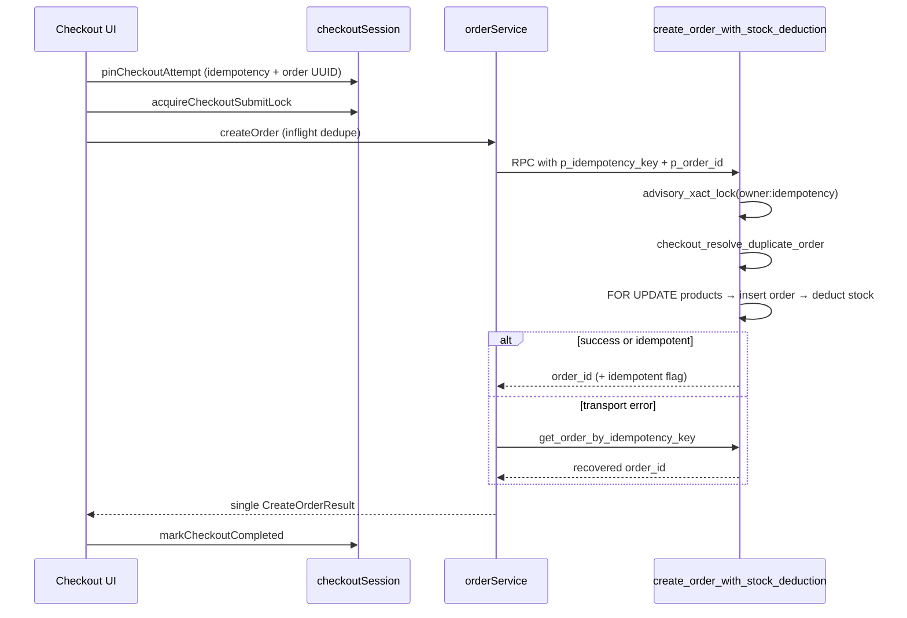

# Order Creation Reliability Audit

**Date:** 2026-06-19  
**Scope:** End-to-end checkout → order RPC → inventory deduction

## Threat Model

| Threat | Mitigation layer |
|--------|------------------|
| Double-click submit | `submitLockRef` + `isSubmitting` + disabled UI |
| Parallel tabs | `acquireCheckoutSubmitLock` (session + localStorage) |
| Concurrent in-flight RPCs | `inflightOrders` Map keyed by `ownerId:idempotencyKey` |
| Network timeout after server success | Idempotency key + `get_order_by_idempotency_key` recovery |
| Page refresh mid-submit | Session-pinned idempotency/order UUID + mount recovery probe |
| Race on duplicate insert | DB unique `(owner_id, idempotency_key)` + `23505` handler + **v28 advisory lock** |
| Overselling stock | `FOR UPDATE` on products + atomic stock deduction in single RPC |
| Cart change mid-checkout | Fingerprint reset rotates idempotency key |

## Architecture (single customer action → single order)



## Existing Protections (verified)

- **`create_order_with_stock_deduction`** — single SECURITY DEFINER transaction: validate → lock products → insert order/items → deduct stock → inventory_movements
- **Idempotency** — `orders.idempotency_key` partial unique index; early return via `checkout_resolve_duplicate_order`
- **Stable client UUID** — `p_order_id` reused on retry; duplicate PK triggers `23505` recovery
- **Client session** — idempotency key in `sessionStorage` until success or cart fingerprint change
- **Recovery RPC** — `get_order_by_idempotency_key` (tenant-scoped in v27)
- **Rate limit** — DB `check_rpc_rate_limit` on checkout RPC (v25)

## Fixes Applied (this audit)

### Client

1. **`pinCheckoutAttempt`** — pins idempotency + order UUID at submit start (before async validation)
2. **Cross-tab lock** — `localStorage` stamp in addition to `sessionStorage`
3. **`hasPendingCheckoutAttempt` + mount recovery** — on checkout load, probe server if session has pending keys
4. **`createOrder` transport recovery** — on network/RPC transport errors, call `tryRecoverCheckoutOrder` before failing; expanded retryable error patterns
5. **Post-retry recovery** — after exhausted retries, final idempotency probe

### Database (v28 — deploy with `npm run db:deploy`)

1. **`pg_advisory_xact_lock(hashtext(owner:idempotency))`** — serializes concurrent requests with the same idempotency key inside one transaction, closing the check-then-insert race window

## Verification Checklist

- [ ] Double-click submit → one order in merchant panel
- [ ] Two tabs submit simultaneously → one order; second tab shows lock toast
- [ ] Kill network after submit, retry → idempotent success or recovery toast
- [ ] Refresh during "creating" phase → mount recovery finds order if created
- [ ] Change cart item → new idempotency key (new order allowed)
- [ ] `npm test` passes

## Deploy

```bash
npm run db:deploy   # applies v28 advisory lock
npm test
```
