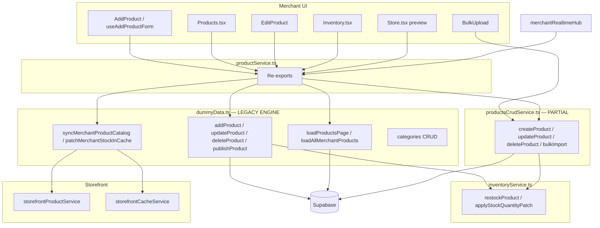
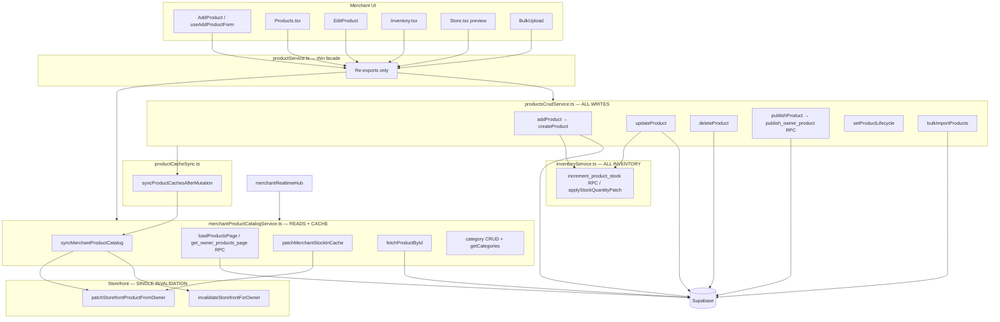

# Product Architecture Audit — dummyData Removal

**Generated:** 2026-06-25  
**Goal:** One product architecture, one inventory architecture, one publish flow, one storefront sync flow — zero production dependencies on `dummyData.ts`.

---

## Executive Summary

| Metric | Before | After |
|--------|--------|-------|
| Production imports of `dummyData.ts` | **1** (`productService.ts`) | **0** |
| Product write paths | **2** (dummyData + productsCrudService) | **1** (`productsCrudService`) |
| Publish flows | **2** (inline in addProduct + publishProduct RPC) | **1** (`publishProduct` in crud) |
| Storefront invalidation entry points | **3+** scattered | **1** (`syncMerchantProductCatalog`) |
| Inventory mutations | **1** (`inventoryService`) | **1** (unchanged) |

**Status:** `dummyData.ts` deleted. All flows route through `productsCrudService` (writes) and `merchantProductCatalogService` (reads/cache).

---

## Before Architecture (Dual Catalog)

### Problems Identified

1. **Dual write path:** `addProduct` (dummyData) vs `createProduct` (crud) — duplicate insert/stock logic.
2. **Full-catalog loader:** `loadAllMerchantProducts` paginated up to 100 pages sequentially (ProductsList legacy path).
3. **Split facade:** UI imported `productService` but bulk import bypassed to `productsCrudService` directly.
4. **Misleading name:** `dummyData.ts` was production Supabase engine, not test fixtures.

---

## After Architecture (Single Source of Truth)

---

## Flow Matrix (After)

| Flow | Single entry point | Storefront sync |
|------|-------------------|-----------------|
| Create product | `productsCrudService.addProduct` | `syncMerchantProductCatalog` via `createProduct` / `publishProduct` |
| Update product | `productsCrudService.updateProduct` | `syncProductCachesAfterMutation` |
| Delete product | `productsCrudService.deleteProduct` | `removeCachedProduct` + `syncMerchantProductCatalog` |
| Publish | `productsCrudService.publishProduct` | RPC row → `syncMerchantProductCatalog` |
| Lifecycle (archive/draft) | `productsCrudService.setProductLifecycle` | via `updateProduct` |
| Inventory restock | `inventoryService.restockProduct` | `patchMerchantStockInCache` |
| Stock on edit | `inventoryService.applyStockQuantityPatch` | via `updateProduct` cache sync |
| Bulk CSV import | `productsCrudService.bulkImportProducts` | `syncProductCachesAfterMutation` |
| Storefront read | `storefrontProductService` | edge cache + `get_storefront_page_bundle` RPC |
| Realtime patch | `merchantRealtimeHub` | `patchCachedProduct` / targeted storefront patch |

---

## Files Changed

| Action | File |
|--------|------|
| **Deleted** | `src/data/dummyData.ts` |
| **Created** | `src/services/merchantProductCatalogService.ts` |
| **Extended** | `src/services/productsCrudService.ts` — `addProduct`, `publishProduct`, `setProductLifecycle` |
| **Rewired** | `src/services/productService.ts` |
| **Rewired** | `src/lib/productCacheSync.ts` |
| **Updated** | `src/data/README.md`, `src/services/index.ts` |

---

## Runtime Dependency Audit (Pre-Change)

All paths imported via `@/services/productService` which re-exported `dummyData.ts`:

| Consumer | Functions used |
|----------|----------------|
| `useAddProductForm` | `addProduct`, `getCategories` |
| `Products.tsx` | `publishProduct`, `setProductLifecycle`, `addProduct`, `getCategories`, `getProductsSync` |
| `EditProduct.tsx` | `updateProduct`, `deleteProduct`, `fetchProductById`, `getCategories` |
| `QuickEditDialog` | `updateProduct`, `fetchProductById` |
| `ProductsList` | `loadProducts`, `loadAllMerchantProducts`, `invalidateProducts` |
| `Inventory.tsx` | `patchMerchantStockInCache` |
| `AuthContext` | `setCurrentOwner`, `setCurrentStore`, `invalidateOwnerCache` |
| `merchantHydration` | `loadProductsPage`, `getCategories`, `setCurrentStore` |
| `merchantRealtimeHub` | `appendCachedProduct`, `patchCachedProduct`, `removeCachedProduct` |
| `productCacheSync` | `syncMerchantProductCatalog` |
| `Store.tsx` / `PreviewStore` | `loadProducts`, `getCategories`, `getProductsByCategory` |
| `CategoryManagement` / `CategoryDialog` | category CRUD |
| `FooterSuggestedProductsManager` | `loadProductsPage`, `getProductsSync` |
| `useMerchantProductsPage` | `loadProductsPage`, `getProductsSync`, `invalidateProducts` |
| `useDashboardInsights` | `getProductsSync` |
| `BulkUpload` | `syncMerchantProductCatalog` (already used crud for import) |

**Post-change:** All consumers unchanged at import site (`productService`); implementation now delegates to crud + catalog services.

---

## Verification Checklist

- [x] Zero `dummyData` references in `src/`
- [x] Single write module: `productsCrudService`
- [x] Single cache/sync module: `merchantProductCatalogService.syncMerchantProductCatalog`
- [x] Single inventory module: `inventoryService`
- [x] Single publish function: `productsCrudService.publishProduct`
- [ ] Run `npm test` locally (shell path encoding blocked CI in agent session)

---

## Recommended Follow-ups

1. Replace `ProductsList` usage of `loadAllMerchantProducts` with `useMerchantProductsPage` (paginated only).
2. Move category CRUD from catalog service to dedicated `categoryService` if it grows.
3. Remove deprecated `products` module mirror export when no callers remain.
