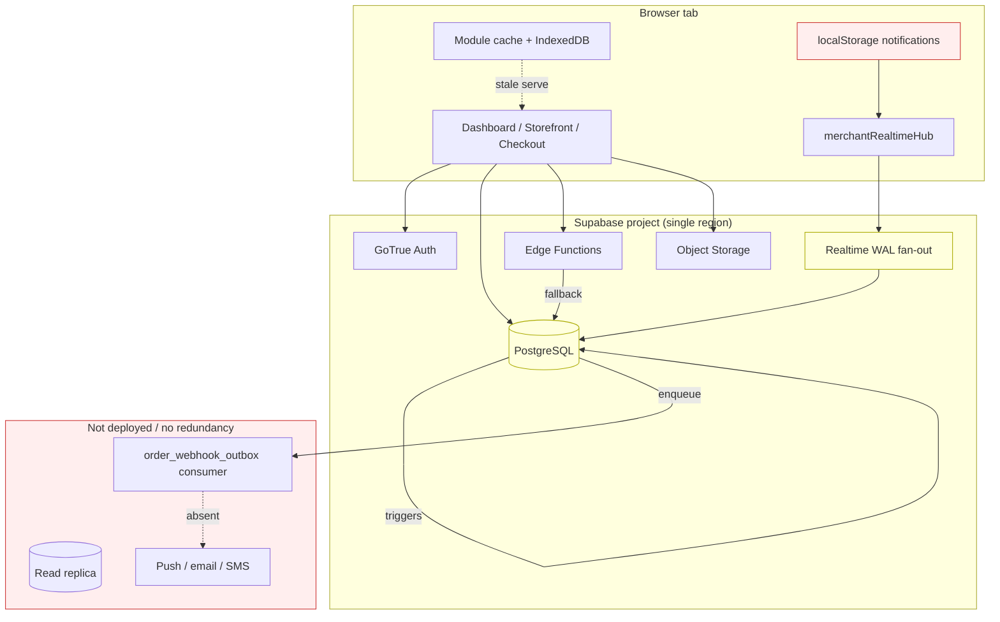
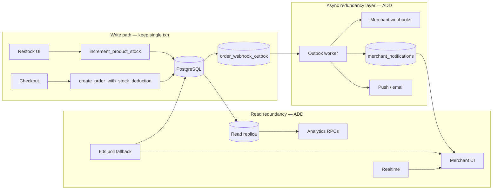

# Single Point of Failure Report

**Date:** 2026-06-19  
**Role:** Site Reliability Engineer (SRE)  
**Scope:** Database · Realtime · Inventory · Orders · Analytics · Notifications  
**Related:** [RESILIENCE_REPORT.md](./RESILIENCE_REPORT.md) · [REALTIME_AUDIT_REPORT.md](./REALTIME_AUDIT_REPORT.md) · [ORDER_RELIABILITY_REPORT.md](./ORDER_RELIABILITY_REPORT.md) · [QUEUE_ARCHITECTURE_REPORT.md](./QUEUE_ARCHITECTURE_REPORT.md)

---

## Executive summary

| Dimension | SPOF exposure | Redundancy maturity | Score |
|-----------|---------------|---------------------|-------|
| **Database** | High — single Postgres project | Partial — optional client failover URL | **68/100** |
| **Realtime** | Medium — one WS path per tab | Partial — backoff reconnect, no poll fallback | **72/100** |
| **Inventory** | Medium — single stock RPC | Low — no restock idempotency | **74/100** |
| **Orders** | Low–medium — atomic RPC is intentional choke point | Strong — idempotency + recovery | **88/100** |
| **Analytics** | Medium — rollup + RPC dependency | Partial — client fallback exists | **70/100** |
| **Notifications** | **High** — client-only, realtime-derived | **Low** — no server delivery | **55/100** |

**Overall platform SPOF resilience score:** **71/100**

**Critical finding:** The order pipeline is well-hardened; **merchant notifications and external webhooks are the weakest redundancy layer** — events are enqueued in `order_webhook_outbox` but **no consumer runs**.

---

## Failure map

High-level dependency graph showing where a single component outage blocks multiple surfaces.



### Blast-radius matrix

| Failed component | Storefront | Checkout | Inventory | Orders UI | Analytics | Notifications |
|------------------|------------|----------|-----------|-----------|-----------|---------------|
| **PostgreSQL down** | Read cache only (~2 min) | **Blocked** | **Blocked** | **Blocked** | **Blocked** | **Blocked** |
| **Auth down** | Public browse OK | **Blocked** | Merchant **Blocked** | Merchant **Blocked** | Merchant **Blocked** | Merchant **Blocked** |
| **Realtime down** | No impact (HTTP) | No impact | Stale until refresh | Stale list | Stale KPIs | **Miss events** |
| **Edge `get-store-products` down** | RPC fallback | — | — | — | — | — |
| **Storage down** | Broken images | — | Upload blocked | — | — | — |
| **Webhook worker absent** | — | Order still created | — | In-app only | — | **No external notify** |
| **Rollup trigger lag** | — | — | — | — | Wrong/stale KPIs | — |

---

## 1. Database

### Architecture

- **Single primary:** All reads and writes go to one Supabase Postgres instance (optional pooler URL on primary only).
- **Tenant isolation:** RLS + `owner_id` RPC guards — correct, but all tenants share one engine.
- **Schema gate:** `platform_health` RPC blocks feature use when migrations lag — single version truth.
- **Hot paths:** `store_visits` (3 writes/visit chain), `orders` + triggers → `store_daily_stats`, `products.stock_quantity` row locks.

### Single points of failure

| ID | Component | Type | Impact if lost |
|----|-----------|------|----------------|
| DB-1 | **Supabase Postgres (primary)** | Infrastructure | Total platform outage; checkout cannot complete |
| DB-2 | **Connection pooler** (when configured) | Network path | All API calls fail even if DB healthy |
| DB-3 | **`create_order_with_stock_deduction`** | Intentional choke point | Checkout stops — by design, not duplicated |
| DB-4 | **`increment_product_stock`** | Single write path | Manual restock fails; checkout stock still via order RPC |
| DB-5 | **`get_store_statistics` / bundle RPC** | Read aggregation | Analytics falls back to 5k-row client scan (slow/timeout) |
| DB-6 | **`trg_orders_daily_stats` + visit triggers** | Async rollup | KPI drift if trigger errors silently |
| DB-7 | **Migration version mismatch** | Ops | Partial feature outage per `platformHealthService` |

### Existing mitigations

| Mitigation | Location | Limitation |
|------------|----------|------------|
| Optional failover URL | `resolveSupabaseConfig`, `useRecoveryMonitor` | Manual env config; **not auto-replicated**; reload required |
| Client cache SWR | `cache.ts`, IndexedDB | Stale read only; no writes |
| Atomic order transaction | v35 RPC | Does not help if DB unreachable |
| Advisory locks + unique idempotency | Order RPC | Per-attempt correctness only |
| Visit dedupe (30 min) | `useStoreVisitTracking` | Reduces load; still single write path |

### Risk analysis — Database

| Risk | Likelihood | Impact | Severity | Notes |
|------|------------|--------|----------|-------|
| Primary region outage | Low | Critical | **P0** | No in-app multi-region |
| Connection saturation | Medium | High | **P1** | Viral storefront + merchant dashboard |
| Rollup lag / trigger failure | Medium | Medium | **P1** | Analytics wrong, not absent |
| Schema drift in production | Medium | High | **P1** | Deploy blocker documented |
| Hot-table lock contention | Medium | Medium | **P2** | Last-unit stock races handled correctly |

---

## 2. Realtime

### Architecture

- **One hub per merchant:** `products-realtime-{ownerId}`, `orders-realtime-{ownerId}`.
- **Publication scope:** Only `orders` + `products` in `supabase_realtime`.
- **Reconnect:** Exponential backoff, **max 6 attempts**, then stops until navigation.
- **Storefront:** Zero Realtime channels — HTTP + cache only.

### Single points of failure

| ID | Component | Type | Impact if lost |
|----|-----------|------|----------------|
| RT-1 | **Supabase Realtime service** | Shared infra | All merchant live updates stop |
| RT-2 | **Single WebSocket per client** | Transport | Disconnect affects orders + inventory UI together |
| RT-3 | **6-attempt reconnect cap** | Client policy | Long outage → **silent staleness** until refresh |
| RT-4 | **WAL publication on 2 tables** | DB config | No realtime for `inventory_movements`, visits, stats |
| RT-5 | **`merchantRealtimeHub` singleton** | Process | Bug or memory issue affects all subscribed pages |

### Existing mitigations

| Mitigation | Detail |
|------------|--------|
| Debounced refetch | 300–500 ms; reduces thundering herd |
| Visibility deferral | Refetch when tab visible after hidden |
| Cache patch before UI notify | Products channel patches cache once |
| `teardownMerchantRealtimeHub` on failover | Clean channel reset on DR reload |
| HTTP fallback for storefront | Not dependent on Realtime |

### Risk analysis — Realtime

| Risk | Likelihood | Impact | Severity |
|------|------------|--------|----------|
| WS disconnect > 6 retries | Medium | Medium | **P1** |
| Realtime lag under WAL pressure | Low | Medium | **P2** |
| Missed event during hub teardown | Low | Low | **P3** |
| Duplicate channels (regression) | Low | Medium | **P2** — currently prevented |

---

## 3. Inventory

### Architecture

- **Checkout deduction:** Inside `create_order_with_stock_deduction` (same txn as order).
- **Manual restock:** `increment_product_stock` RPC (`inventoryService.restockProduct`).
- **Threshold-only edits:** Direct `products` UPDATE (separate from stock RPC).
- **UI sync:** `products` Realtime channel + `patchMerchantStockInCache`.
- **Audit:** `inventory_movements` — on-demand fetch, not realtime.

### Single points of failure

| ID | Component | Type | Impact if lost |
|----|-----------|------|----------------|
| INV-1 | **`increment_product_stock` RPC** | Write path | Manual restock fails |
| INV-2 | **Products Realtime channel** | UI sync | Stock counts stale on Inventory page |
| INV-3 | **No restock idempotency** | Client gap | Double-click restock could double-add (RPC should be atomic — verify DB) |
| INV-4 | **Module cache `products:{ownerId}`** | Client SPOF | Wrong stock shown if cache stale and RT dead |
| INV-5 | **`inventory_movements` read path** | Non-critical | History dialog empty on DB error |

### Existing mitigations

| Mitigation | Detail |
|------------|--------|
| Atomic stock in checkout RPC | No partial order on insufficient stock |
| `p_min_stock_level` in same RPC (v43) | Fewer round-trips |
| `record_product_initial_stock` (v45) | Initial stock + movement in one txn |
| Health events | `recordHealthEvent('inventory', …)` |

### Risk analysis — Inventory

| Risk | Likelihood | Impact | Severity |
|------|------------|--------|----------|
| Stale stock UI after RT cap | Medium | Medium | **P1** |
| Restock RPC failure (no retry) | Medium | Low | **P2** |
| Cache/DB divergence | Low | Medium | **P2** |
| Checkout stock race (last unit) | Medium | Low | **P3** — expected business outcome |

---

## 4. Orders

### Architecture

Defense-in-depth documented in [ORDER_RELIABILITY_REPORT.md](./ORDER_RELIABILITY_REPORT.md):

```
UI locks → idempotency key → inflight dedup → RPC advisory lock → UNIQUE index → atomic txn
```

### Single points of failure

| ID | Component | Type | Impact if lost |
|----|-----------|------|----------------|
| ORD-1 | **`create_order_with_stock_deduction`** | Intentional SPOF | No orders created — correct failure mode |
| ORD-2 | **PostgreSQL availability** | Infrastructure | Checkout blocked |
| ORD-3 | **`get_order_by_idempotency_key`** | Recovery path | Transport retry cannot recover without it |
| ORD-4 | **Orders Realtime channel** | UI sync | Dashboard/Orders list stale |
| ORD-5 | **`order_webhook_outbox` without worker** | **Missing redundancy** | External systems never notified |

### Existing mitigations (strong)

| Layer | Control |
|-------|---------|
| Client | `submitLockRef`, cross-tab lock, stable order UUID |
| Service | `inflightOrders`, 3× network retry, recovery RPC |
| Database | Idempotency unique index, advisory lock, single transaction |
| Cache | `flushOrderCache` on success + realtime invalidation |

### Risk analysis — Orders

| Risk | Likelihood | Impact | Severity |
|------|------------|--------|----------|
| Duplicate order (same attempt) | Very low | High | **P3** — well mitigated |
| Lost order on network + no recovery RPC | Low | Critical | **P2** |
| Stale order list (RT exhausted) | Medium | Medium | **P2** |
| External webhook never delivered | **Certain** | High | **P0** — no consumer |

**Verdict:** Order **integrity** SPOF is acceptable; order **delivery to external systems** is not redundant.

---

## 5. Analytics

### Architecture

- **Primary path:** `get_statistics_page_bundle` → `get_store_statistics` KPI RPCs.
- **DB async:** `trg_orders_daily_stats`, visit rollups → `store_daily_stats`.
- **Fallback:** Client fetches up to **5,000 orders + 5,000 visits** when RPC unusable.
- **Invalidation:** Order Realtime → `flushOrderCache` → Statistics refetch.
- **Client cache:** 90s analytics TTL; `:kpi` vs `:chart` keys (memory audit).

### Single points of failure

| ID | Component | Type | Impact if lost |
|----|-----------|------|----------------|
| AN-1 | **`get_store_statistics` RPC** | Read aggregation | Fallback scan or empty KPIs |
| AN-2 | **`store_daily_stats` rollups** | Derived data | KPI mismatch vs raw orders |
| AN-3 | **12s fetch timeout** | Client policy | Empty stats + user warning |
| AN-4 | **Order Realtime for refresh** | Event-driven | Stale charts until manual refresh |
| AN-5 | **Single analytics query on primary** | Infra | Competes with checkout writes |

### Existing mitigations

| Mitigation | Detail |
|------------|--------|
| Bundle RPC | One round-trip for current + previous period |
| Lazy chart tabs | `includeChartOrders` defers heavy fetch |
| `truncated` flag | UI warns when caps hit |
| DB triggers | Offload aggregation from request path |

### Risk analysis — Analytics

| Risk | Likelihood | Impact | Severity |
|------|------------|--------|----------|
| RPC missing (migration lag) | Medium | High | **P1** |
| Rollup drift | Low | Medium | **P2** |
| Fallback timeout on large stores | Medium | Medium | **P2** |
| Analytics stale during RT outage | Medium | Low | **P3** |

---

## 6. Notifications

### Architecture

| Layer | Implementation |
|-------|----------------|
| **In-app** | `useOrderNotifications` — derived from `useRealtimeOrders` events |
| **Persistence** | `localStorage` only, max **50** per owner |
| **Server** | `order_webhook_outbox` table + trigger on `orders` INSERT |
| **Delivery** | **No worker** — outbox rows never processed |
| **Push / email / SMS** | **Not implemented** |

### Single points of failure

| ID | Component | Type | Impact if lost |
|----|-----------|------|----------------|
| NTF-1 | **Realtime order events** | Sole event source | No in-app notification if WS dead |
| NTF-2 | **localStorage** | Per-browser store | No cross-device; cleared on browser reset |
| NTF-3 | **Missing outbox consumer** | Ops gap | Merchant webhooks, Slack, email never fire |
| NTF-4 | **No server notification table** | Product gap | Cannot replay missed notifications |
| NTF-5 | **Tab not on Orders page** | UX | Toasts only where `useRealtimeOrders` mounted |

### Existing mitigations

| Mitigation | Detail |
|------------|--------|
| `MAX_STORED = 50` | Caps localStorage growth |
| Unique index on outbox | Prevents duplicate enqueue per order/event |
| Order list still in DB | Recoverable via manual refresh — not push |

### Risk analysis — Notifications

| Risk | Likelihood | Impact | Severity |
|------|------------|--------|----------|
| Missed notification (RT cap) | Medium | High | **P0** |
| Lost history (new browser) | High | Medium | **P1** |
| External integrator never notified | **Certain** | Critical | **P0** |
| No mobile push when app closed | High | High | **P1** |

**Verdict:** Notifications are the **highest SPOF exposure** in this audit.

---

## Cross-cutting infrastructure SPOFs

| Component | Redundant? | Notes |
|-----------|------------|-------|
| Supabase project (region) | **No** | Optional second URL is manual DR, not HA |
| Edge Functions isolate | **Partial** | Storefront falls back to RPC |
| Object Storage bucket | **No** | Image CDN not separate |
| Auth (GoTrue) | **No** | Supabase-managed single service |
| Client observability webhook | **Optional** | `VITE_OBSERVABILITY_WEBHOOK_URL` — best-effort beacon |
| `platformHealthService` cache | **N/A** | 30s cache — health check SPOF for deploy detection |

---

## Redundancy recommendations

Prioritized by impact × effort. Items marked **Shipped** already exist in codebase.

### P0 — Eliminate critical SPOFs

| # | Recommendation | Domains | Effort | Expected outcome |
|---|----------------|---------|--------|------------------|
| R1 | **Deploy `order_webhook_outbox` consumer** (Edge Function + cron or `pg_cron` + `pg_net`) | Orders, Notifications | M | External webhooks actually deliver; retriable |
| R2 | **Server-side notification inbox** (`merchant_notifications` table + RPC poll) | Notifications | M | Survives RT outage + cross-device |
| R3 | **Polling fallback when Realtime exhausted** (60s order poll on Orders/Dashboard) | Realtime, Orders, Notifications | S | UI freshness without full page reload |
| R4 | **Document + test failover Supabase** runbook | Database | S | RTO ≤ 30 min per `DR_TARGETS` |

### P1 — Reduce blast radius

| # | Recommendation | Domains | Effort | Expected outcome |
|---|----------------|---------|--------|------------------|
| R5 | **Read replica / analytics connection** for statistics RPCs | Database, Analytics | L | Checkout not starved by chart queries |
| R6 | **Rollup lag monitor** — alert when `store_daily_stats` diverges from raw counts | Analytics | S | Early KPI corruption detection |
| R7 | **Restock idempotency key** on `increment_product_stock` | Inventory | S | Safe double-submit |
| R8 | **Inventory poll fallback** on Inventory page when RT status degraded | Inventory, Realtime | S | Stock UI self-heals |
| R9 | **Raise or reset RT reconnect** after visibility + manual “تحديث” | Realtime | S | Avoid silent 6-attempt dead zone |
| R10 | **Async visit write buffer** (queue table + batch insert) | Database, Analytics | L | `store_visits` not a traffic SPOF |

### P2 — Operational resilience

| # | Recommendation | Domains | Effort | Expected outcome |
|---|----------------|---------|--------|------------------|
| R11 | **Multi-AZ Supabase plan + PITR** enabled | Database | Ops | RPO < 60 min |
| R12 | **CDN in front of Storage** public URLs | Storefront | M | Storage outage degrades, not kills |
| R13 | **Push notifications** (FCM/Web Push) fed from outbox worker | Notifications | L | Merchant alerted when tab closed |
| R14 | **Circuit breaker UI** — global “live updates paused” banner when RT dead | Realtime | S | User knows to refresh |
| R15 | **Secondary observability** (Sentry/Datadog) beyond optional webhook | All | S | Incident detection not client-only |

### P3 — Long-term

| # | Recommendation | Domains | Effort |
|---|----------------|---------|--------|
| R16 | Active-active multi-region (read path) | Database, Storefront | XL |
| R17 | Event bus (Kafka/NATS) decoupled from Realtime | All merchant events | XL |
| R18 | Offline merchant mutation queue (IndexedDB replay) | Inventory, Products | M |

---

## Redundancy target architecture (recommended)



**Principle:** Keep **one authoritative write path** per domain (orders, stock). Add redundancy on **delivery, read, and observation** — not duplicate competing writers.

---

## SPOF scorecard summary

| Domain | Intentional SPOF (OK) | Accidental SPOF (fix) | Score |
|--------|----------------------|------------------------|-------|
| Database | Single txn checkout | No replica; hot visits table | 68 |
| Realtime | N/A | 6-retry cap, no poll | 72 |
| Inventory | Single stock RPC | RT-only UI sync | 74 |
| Orders | Atomic order RPC | Webhook worker missing | 88 |
| Analytics | KPI rollup path | Fallback scan timeout | 70 |
| Notifications | N/A | localStorage + RT only | 55 |

**Weighted overall: 71/100**

---

## Monitoring & SLO suggestions

| Signal | SLO / alert | Detects |
|--------|-------------|---------|
| `create_order_with_stock_deduction` p99 latency | > 3s for 5 min | DB saturation SPOF |
| Realtime `max reconnect attempts` (healthMonitor) | > 10/hour/merchant | RT-3 |
| `order_webhook_outbox` pending age | > 5 min | R1 not running |
| `store_daily_stats` vs raw order count drift | > 1% daily | AN-2 |
| Checkout error rate | > 2% for 10 min | DB-1 / ORD-1 |
| Platform health `migration_required` | any in prod | DB-7 |

---

## Related work already shipped

| Control | Report |
|---------|--------|
| Order idempotency + atomic stock | ORDER_RELIABILITY_REPORT v35 |
| Realtime hub + noise filters | REALTIME_AUDIT_REPORT |
| Failover URL + recovery monitor | RESILIENCE_REPORT |
| Visit dedupe + deferred RPC | HOT_TABLE_REPORT |
| Statistics bundle RPC | ANALYTICS_ACCURACY_REPORT |
| Outbox table + trigger (enqueue only) | QUEUE_ARCHITECTURE_REPORT |

**Next highest-ROI action:** **R1 + R2 + R3** — complete the notification redundancy story without weakening order inventory correctness.
